# Real Estate Management System

## 1. Introduction

### 1.1 Purpose of this Document

This document is mainly for the current (and future) developers of **The Real Estate Management System**. This document focuses on describing each and every aspect in the system so that future updates and maintanance can easily be applied without any contradictions.

### 1.2 Scope of this Document

This document covers everything from _A_ to _Z_ . It covers the business model and its processes to the enhancements made with the software development and every update happened on the system. It also includes technical and non-technical descriptions about the business and the software. All the team members participated in building this document on differnet approaches from collectiong data and meets with the client to formatting the document to be on this organized form. This document is written in **Markdown** Language (.md) and that's to ensure readability on virtual platforms i.e. Github. The first release of this document was before the launch of the software so future updates and changes in the document may occur.

### 1.3 Overview

**Real Estate Management System** is a web-based system that allows Real Estate Agents to easily manage the units and customer needs. The system provides an interface for agents to easily communicate and arrange deals with owners and buyers. Agents can view their units, clients, and owners. They also have access to a dashboard to track financial growth and unit status, location, and details.

**Key features include:**

- **Listing Properties**
  - Add new properties for rent or sale.
  - Update property status (available, sold, or rented).
- **Managing Deals**
  - Track property status and transactions.
  - Follow up with clients until unit handover.
- **Commission & Payments**
  - Monitor financial transactions and commissions.
  - Manage rent payments and revenue tracking.
- **Automated Messaging System**
  - Message customers (non-buyers) for units availability.
  - Message Investors and Businessmen for available properties.

### 1.4 Business Context

**Luxville** is sponsoring the production of this model, as all information and business requirements are mostly captured from this company.
**Business Mission:**

- **Provide** the most suitable **property**(unit) for **customers** based on budget, location, and preferences
- **Market** properties on behalf of owners
- **Connect** **owners** with **buyers**.

**Organizational Objectives:**
**Expand their market reach** while **maintaining an organized and efficient approach** of **deal managament** with **high user satisfaction**. Currently their real estate operations are focused on 6th of October city. However, their long-term plan is to scale operations to cover Sheikh Zayed, New Cairo (Tagamoa), and expand across Egypt.

---

## 2. General Description

---

### 2.1 Product Functions

The system functions as an all-in-one management solution for a LuxVille, organizing key operations such as property management and transaction documentation. It ensures accurate tracking of deals , finances and property status, improving efficieny and provide more organized real estate operations.

### 2.2 Similiar System Information

This system is designed as a **stand-alone** real estate management platform, offering features for property administration and transaction documentation. While it operates independently, it supports integration with third-party services such as cloud storage (Google Drive, AWS) for document management, communication platforms for automated notifications ( Whatsapp ), and relational databases (MySQL) for efficient data storage and retrieval. Unlike standard property management software, this system is designed to fit the company's workflows, making operations more efficient and well-organized.

 <!-- Standard property management software is generic and not customized.
    ✅ Your system is tailored to fit your company’s specific workflows.  
    
    3ayz a rephrase 
      -->

### 2.3 **User Characteristics**

The Real Estate Management System was created specifically for organization's internal use at **Luxville**. No external or public users interact with the system.

#### 1. **Administration**

- Manage financial transactions.
- Control employee access, roles, permissions and system operations.
- Ensure overall system integrity, audit logging.

#### 2. **Property Management Team**

- Utilize tools to manage property listings, track client leads, and finalize rental or sales deals.
- Receive automated notifications for client inquiries, and follow-up actions.
- Access reports detailing property usage, rental income, pending payments, and service history.

- Stay updated on deal progress, system alerts, and property status changes through internal notifications.

### 2.4 User Problem Statement

**Luxville** faces several challenges due to the absence of a structured management system, **including**:

- **Property and Schedule Conflicts** - Mismanagement of property availability and meeting arrangements.
- **Data Redundancy and Loss** - Inefficient record-keeping causing missing or duplicate information.
- **Slow Data Retrieval** - Difficulty accessing transaction records and property details.
- **Lack of Updates** - Outdated information affecting decision-making and operations.
- **Difficult Follow-Ups** - Lack of an automated system to track operations

### 2.5 User Objectives

- Manage property listings and availability.
- Handle client interactions and follow-ups.
- Create and track deals (selling or renting).
- Maintain secure and role-based system access.
- Monitor financial transactions.
- Create and track selling and renting deals.
- Generate reports for analysis and decision-making.

### 2.6 General Constraints

- **Time Constraints :** the system must deliver fast and responsive performance for all SystemUsers.
- **Maintainability:** The system should be designed for easy updates and maintenance.
- **Security :** The system must keep data safe and protect against unauthorized access.
- **Platform:** The system must be web-based and accessible on desktops running Mac or Windows.

---

## 3. Functional Requiremtns

> 1. Login (any)
> 2. Logout (any)
> 3. Create Account (admin)
> 4. Delete Account (admin)
> 5. Modify Account (any)
> 6. View Accounts (admin)
> 7. Filter Accounts (admin)
> 8. Sort Accounts (admin)
> 9. Reset Password (any)
> 10. Add Property (admin)
> 11. Delete Property (admin)
> 12. Modify Property (admin)
> 13. View Properties (any)
> 14. Filter Properties (admin)
> 15. Sort Properties (admin)
> 16. Create Role (admin)
> 17. Delete Role (admin)
> 18. Modify Role Name (admin)
> 19. Modify Role Permission (admin)
> 20. View Roles (admin)
> 21. Filter Roles (admin)
> 22. Sort Roles (admin)
> 23. Create Deal (broker)
> 24. Delete Deal (broke5)
> 25. Modify Deal (broker)
> 26. View Deals (broker)
> 27. Filter Deals (broker)
> 28. Sort Deals (broker)
> 29. View System Logs (admin)
> 30. Filter System Logs (admin)
> 31. Sort System Logs (admin)

## Table 1: Functional Requirement FR001

<table>
	<tr>
		<td>Function Name</td>
		<td>Login (any)</td>
	</tr>
	<tr>
		<td>Description</td>
		<td>
		In this function, any user with an account is allowed to login into the system using a username and a password</td>
	</tr>
	<tr>
		<td>Critically</td>
		<td>High</td>
	</tr>
	<tr>
		<td>Technical issues</td>
		<td>
		- First login requires a password reset 
		- Username and password must be validated 
		- After a successful login, a session must be created 
		- A login session must be destroyed after 1 hour of inactivity 
		- Login time should be logged in the database 
		- Log action</td>
	</tr>
	<tr>
		<td>Cost and schedule</td>
		<td>3 days</td>
	</tr>
	<tr>
		<td>Risks</td>
		<td>
		- System could be prone to SQL injection 
		- Incorrectly validating username and password 
		- Spam login to slow down the system 
		- Scripts or bots trying to login</td>
	</tr>
	<tr>
		<td>Dependencies with other requirements</td>
		<td>
		- This requirment depends on the Password Reset requirment</td>
	</tr>
	<tr>
		<td>Pre-Condition</td>
		<td>
		- User already has an account created for him 
		- User has already reset his password atleast once</td>
	</tr>
	<tr>
		<td>Post-Condition</td>
		<td>
		- A session is created for the user and a timer for it is set 
		- User is redirected to the home page</td>
	</tr>
</table>
     

## Table 2: Functional Requirement FR002

<table>
	<tr>
		<td>Function Name</td>
		<td>Logout (any)</td>
	</tr>
	<tr>
		<td>Description</td>
		<td>
		In this function, any logged-in user is allowed to logout of the system</td>
	</tr>
	<tr>
		<td>Critically</td>
		<td>Medium</td>
	</tr>
	<tr>
		<td>Technical issues</td>
		<td>
		- Session must be destroyed after logging out 
		- Logout time should be logged in the database 
		- Log action</td>
	</tr>
	<tr>
		<td>Cost and schedule</td>
		<td>1 day</td>
	</tr>
	<tr>
		<td>Risks</td>
		<td>
		- If session is not correctly destroyed, there will be a possibility of a breach into the system 
		- For example, if an admin tries to logout at home and leaves his laptop open, his children could come playing and easily gain access into the system without having to login again due to the sessions still being alive</td>
	</tr>
	<tr>
		<td>Dependencies with other requirements</td>
		<td>
		- This requirment depends on the Login requirment</td>
	</tr>
	<tr>
		<td>Pre-Condition</td>
		<td>
		- User is already logged in with a session created for him</td>
	</tr>
	<tr>
		<td>Post-Condition</td>
		<td>
		- The session is destroyed for the user 
		- User is redirected to the login page</td>
	</tr>
</table>
     

## Table 3: Functional Requirement FR003

<table>
	<tr>
		<td>Function Name</td>
		<td>Create Account (admin)</td>
	</tr>
	<tr>
		<td>Description</td>
		<td>
		In this function, any logged-in admin should be able to create accounts for fellow users</td>
	</tr>
	<tr>
		<td>Critically</td>
		<td>High</td>
	</tr>
	<tr>
		<td>Technical issues</td>
		<td>
		- The admin should ask the user what his preferred username would look like 
		- An account should be created with the requested username and a randomly generated password 
		- Password must be hashed using a secure hashing algorithm 
		- Log action</td>
	</tr>
	<tr>
		<td>Cost and schedule</td>
		<td>2 days</td>
	</tr>
	<tr>
		<td>Risks</td>
		<td>None</td>
	</tr>
	<tr>
		<td>Dependencies with other requirements</td>
		<td>
		- This requirment depends on the Login requirment</td>
	</tr>
	<tr>
		<td>Pre-Condition</td>
		<td>
		- User is already logged in with a session created for him 
		- User has permission to create accounts</td>
	</tr>
	<tr>
		<td>Post-Condition</td>
		<td>
		- An account is created and stored in database 
		- Page is refreshed</td>
	</tr>
</table>
     

## Table 4: Functional Requirement FR004

<table>
	<tr>
		<td>Function Name</td>
		<td>Delete Account (admin)</td>
	</tr>
	<tr>
		<td>Description</td>
		<td>
		In this function, any logged-in admin should be able to delete accounts for fellow users</td>
	</tr>
	<tr>
		<td>Critically</td>
		<td>High</td>
	</tr>
	<tr>
		<td>Technical issues</td>
		<td>
		- Confirmation is to be asked for before deletion of any account 
		- An account must be permenantly deleted 
		- Log action</td>
	</tr>
	<tr>
		<td>Cost and schedule</td>
		<td>1 day </td>
	</tr>
	<tr>
		<td>Risks</td>
		<td>
		- Deleting wrong accounts</td>
	</tr>
	<tr>
		<td>Dependencies with other requirements</td>
		<td>
		- This requirment depends on the Login & Create Account requirments</td>
	</tr>
	<tr>
		<td>Pre-Condition</td>
		<td>
		- User is already logged in with a session created for him 
		- User has permission to delete accounts</td>
	</tr>
	<tr>
		<td>Post-Condition</td>
		<td>
		- An account is deleted from the database 
		- Page is refreshed 
		- Account deletion should be logged in the database</td>
	</tr>
</table>
     

## Table 5: Functional Requirement FR005

<table>
	<tr>
		<td>Function Name</td>
		<td>Modify Account (any)</td>
	</tr>
	<tr>
		<td>Description</td>
		<td>
		In this function, any logged-in user can modify his account info such as username, password, phone number etc...</td>
	</tr>
	<tr>
		<td>Critically</td>
		<td>Low</td>
	</tr>
	<tr>
		<td>Technical issues</td>
		<td>
		- Changes on the client side must appear in the database as well</td>
	</tr>
	<tr>
		<td>Cost and schedule</td>
		<td>2 days</td>
	</tr>
	<tr>
		<td>Risks</td>
		<td>None</td>
	</tr>
	<tr>
		<td>Dependencies with other requirements</td>
		<td>
		- This requirment depends on the Login & Create Account requirments</td>
	</tr>
	<tr>
		<td>Pre-Condition</td>
		<td>
		- User is already logged in with a session created for him 
		- User is in profile page</td>
	</tr>
	<tr>
		<td>Post-Condition</td>
		<td>
		- Changes applied in database 
		- Page is refreshed </td>
	</tr>
</table>
     

## Table 6: Functional Requirement FR006

<table>
	<tr>
		<td>Function Name</td>
		<td>View Accounts (admin)</td>
	</tr>
	<tr>
		<td>Description</td>
		<td>
		In this function, any logged-in admin can view a list of all the registered accounts in the system</td>
	</tr>
	<tr>
		<td>Critically</td>
		<td>High</td>
	</tr>
	<tr>
		<td>Technical issues</td>
		<td>
		- View a list of accounts 
		- Ability to select one or more accounts and delete them 
		- Clicking on an account redirects to that account's profile page</td>
	</tr>
	<tr>
		<td>Cost and schedule</td>
		<td>2 days</td>
	</tr>
	<tr>
		<td>Risks</td>
		<td>None</td>
	</tr>
	<tr>
		<td>Dependencies with other requirements</td>
		<td>
		- This requirment depends on the Login & Create Account & Delete Account requirments</td>
	</tr>
	<tr>
		<td>Pre-Condition</td>
		<td>
		- User is already logged in with a session created for him 
		- User is in accounts page</td>
	</tr>
	<tr>
		<td>Post-Condition</td>
		<td>List of accounts is queried from the database</td>
	</tr>
</table>
     

## Table 7: Functional Requirement FR007

<table>
	<tr>
		<td>Function Name</td>
		<td>Filter accounts (admin)</td>
	</tr>
	<tr>
		<td>Description</td>
		<td>
		In this function, any logged-in admin can filter the list of accounts by multiple criteria</td>
	</tr>
	<tr>
		<td>Critically</td>
		<td>Low</td>
	</tr>
	<tr>
		<td>Technical issues</td>
		<td>
		- Filter by name 
		- Filter by last login date 
		- Filter by phone number 
		- Filter by email</td>
	</tr>
	<tr>
		<td>Cost and schedule</td>
		<td>2 days</td>
	</tr>
	<tr>
		<td>Risks</td>
		<td>
		- SQL injection</td>
	</tr>
	<tr>
		<td>Dependencies with other requirements</td>
		<td>
		- This requirment depends on the Login requirments</td>
	</tr>
	<tr>
		<td>Pre-Condition</td>
		<td>
		- User is already logged in with a session created for him 
		- User is in accounts page</td>
	</tr>
	<tr>
		<td>Post-Condition</td>
		<td>List of accounts is queried using a conditioned query</td>
	</tr>
</table>
     

## Table 8: Functional Requirement FR008

<table>
	<tr>
		<td>Function Name</td>
		<td>Sort Accounts (admin)</td>
	</tr>
	<tr>
		<td>Description</td>
		<td>
		In this function, any logged-in admin can sort the list of accounts by multiplie criteria</td>
	</tr>
	<tr>
		<td>Critically</td>
		<td>Low</td>
	</tr>
	<tr>
		<td>Technical issues</td>
		<td>
		- Sort by name 
		- Sort by last login</td>
	</tr>
	<tr>
		<td>Cost and schedule</td>
		<td>2 days</td>
	</tr>
	<tr>
		<td>Risks</td>
		<td>None</td>
	</tr>
	<tr>
		<td>Dependencies with other requirements</td>
		<td>
		- This requirment depends on the Login requirment</td>
	</tr>
	<tr>
		<td>Pre-Condition</td>
		<td>
		- User is on logged-in and is in the accounts page 
		- Has permission to view accounts</td>
	</tr>
	<tr>
		<td>Post-Condition</td>
		<td>
		- List of accounts is queried using an ordered query</td>
	</tr>
</table>
     

## Table 9: Functional Requirement FR009

<table>
	<tr>
		<td>Function Name</td>
		<td>Reset Password (any)</td>
	</tr>
	<tr>
		<td>Description</td>
		<td>
		In this function, any logged-in user can request a password reset</td>
	</tr>
	<tr>
		<td>Critically</td>
		<td>High</td>
	</tr>
	<tr>
		<td>Technical issues</td>
		<td>
		- Upon requesting a reset, an email should be sent to continue the operation 
		- Validate new password 
		- Hash new password and apply changes in the database</td>
	</tr>
	<tr>
		<td>Cost and schedule</td>
		<td>3 days</td>
	</tr>
	<tr>
		<td>Risks</td>
		<td>
		- Forgetting to validate or hash new password 
		- Email service is down (send error back) 
		- SQL injection</td>
	</tr>
	<tr>
		<td>Dependencies with other requirements</td>
		<td>
		- This requirment depends on the Login requirment</td>
	</tr>
	<tr>
		<td>Pre-Condition</td>
		<td>
		- User is on login page 
		- Hasn't reset password in the last hour unless first time</td>
	</tr>
	<tr>
		<td>Post-Condition</td>
		<td>
		- Success message appears 
		- User is redirected to login page again</td>
	</tr>
</table>
     

## Table 10: Functional Requirement FR010

<table>
	<tr>
		<td>Function Name</td>
		<td>Add Property (admin)</td>
	</tr>
	<tr>
		<td>Description</td>
		<td>
		In this function, any logged-in admin can register a property into the system</td>
	</tr>
	<tr>
		<td>Critically</td>
		<td>High</td>
	</tr>
	<tr>
		<td>Technical issues</td>
		<td>
		- Property coordinates should be supplied 
		- Should register owner info as well 
		- Handle property image & video storing 
		- Log action</td>
	</tr>
	<tr>
		<td>Cost and schedule</td>
		<td>3 days</td>
	</tr>
	<tr>
		<td>Risks</td>
		<td>
		- SQL injection</td>
	</tr>
	<tr>
		<td>Dependencies with other requirements</td>
		<td>
		- This requirment depends on the Login & View Properties requirments</td>
	</tr>
	<tr>
		<td>Pre-Condition</td>
		<td>
		- User is already logged in with a session created for him 
		- User is in properties page 
		- User has permission to add properties</td>
	</tr>
	<tr>
		<td>Post-Condition</td>
		<td>
		- Property is registered into the system 
		- Page is refreshed</td>
	</tr>
</table>
     

## Table 11: Functional Requirement FR011

<table>
	<tr>
		<td>Function Name</td>
		<td>Delete Property (admin)</td>
	</tr>
	<tr>
		<td>Description</td>
		<td>
		In this function, any logged-in admin can delete a property from the system</td>
	</tr>
	<tr>
		<td>Critically</td>
		<td>High</td>
	</tr>
	<tr>
		<td>Technical issues</td>
		<td>
		- Should ask for confirmation first 
		- Permenantly delete 
		- Log action</td>
	</tr>
	<tr>
		<td>Cost and schedule</td>
		<td>1 day</td>
	</tr>
	<tr>
		<td>Risks</td>
		<td>None</td>
	</tr>
	<tr>
		<td>Dependencies with other requirements</td>
		<td>
		- This requirment depends on the Login & View Properties requirments</td>
	</tr>
	<tr>
		<td>Pre-Condition</td>
		<td>
		- User is already logged in with a session created for him 
		- User is in properties page 
		- User has permission to delete properties</td>
	</tr>
	<tr>
		<td>Post-Condition</td>
		<td>
		- Property is deleted from the system 
		- Page is refreshed</td>
	</tr>
</table>
     

## Table 12: Functional Requirement FR012

<table>
	<tr>
		<td>Function Name</td>
		<td>Modify Property (admin)</td>
	</tr>
	<tr>
		<td>Description</td>
		<td>
		In this function, any logged-in admin can modify property information</td>
	</tr>
	<tr>
		<td>Critically</td>
		<td>High</td>
	</tr>
	<tr>
		<td>Technical issues</td>
		<td>
		- Clicking on an edit button next to property opens a pop up 
		- After changing needed information, click save to update the database 
		- Log action</td>
	</tr>
	<tr>
		<td>Cost and schedule</td>
		<td>2 days</td>
	</tr>
	<tr>
		<td>Risks</td>
		<td>None</td>
	</tr>
	<tr>
		<td>Dependencies with other requirements</td>
		<td>
		- This requirment depends on the Login & View Properties requirments</td>
	</tr>
	<tr>
		<td>Pre-Condition</td>
		<td>
		- User is already logged in with a session created for him 
		- User is in properties page 
		- User has permission to modify properties</td>
	</tr>
	<tr>
		<td>Post-Condition</td>
		<td>
		- Property is updated in the database 
		- Page is refreshed</td>
	</tr>
</table>
     

## Table 13: Functional Requirement FR013

<table>
	<tr>
		<td>Function Name</td>
		<td>View Properties (any)</td>
	</tr>
	<tr>
		<td>Description</td>
		<td>
		In this function, any logged-in admin can view properties as a list</td>
	</tr>
	<tr>
		<td>Critically</td>
		<td>High</td>
	</tr>
	<tr>
		<td>Technical issues</td>
		<td>
		- Each property has an edit and a delete button 
		- Display in grid-like form where columns represent specific property information like price for example</td>
	</tr>
	<tr>
		<td>Cost and schedule</td>
		<td>2 days</td>
	</tr>
	<tr>
		<td>Risks</td>
		<td>None</td>
	</tr>
	<tr>
		<td>Dependencies with other requirements</td>
		<td>
		- This requirment depends on the Login requirments</td>
	</tr>
	<tr>
		<td>Pre-Condition</td>
		<td>
		- User is already logged in with a session created for him 
		- User is in properties page 
		- User has permission to view properties</td>
	</tr>
	<tr>
		<td>Post-Condition</td>
		<td>List of properties is queried from the database</td>
	</tr>
</table>
     

## Table 14: Functional Requirement FR014

<table>
	<tr>
		<td>Function Name</td>
		<td>Filter Properties (admin)</td>
	</tr>
	<tr>
		<td>Description</td>
		<td>
		In this function, any logged-in admin can filter properties based on multiple criteria</td>
	</tr>
	<tr>
		<td>Critically</td>
		<td>Medium</td>
	</tr>
	<tr>
		<td>Technical issues</td>
		<td>
		- Filter by property location 
		- Filter by property price</td>
	</tr>
	<tr>
		<td>Cost and schedule</td>
		<td>2 days</td>
	</tr>
	<tr>
		<td>Risks</td>
		<td>None</td>
	</tr>
	<tr>
		<td>Dependencies with other requirements</td>
		<td>
		- This requirment depends on the Login requirments</td>
	</tr>
	<tr>
		<td>Pre-Condition</td>
		<td>
		- User is already logged in with a session created for him 
		- User is in properties page 
		- User has permission to view properties</td>
	</tr>
	<tr>
		<td>Post-Condition</td>
		<td>Properties list is queried using a conditioned query</td>
	</tr>
</table>
     

## Table 15: Functional Requirement FR015

<table>
	<tr>
		<td>Function Name</td>
		<td>Sort Properties (admin)</td>
	</tr>
	<tr>
		<td>Description</td>
		<td>
		In this function, any logged-in admin can sort properties based on multiple criteria</td>
	</tr>
	<tr>
		<td>Critically</td>
		<td>Low</td>
	</tr>
	<tr>
		<td>Technical issues</td>
		<td>
		- Sort by property price</td>
	</tr>
	<tr>
		<td>Cost and schedule</td>
		<td>2 days</td>
	</tr>
	<tr>
		<td>Risks</td>
		<td>None</td>
	</tr>
	<tr>
		<td>Dependencies with other requirements</td>
		<td>
		- This requirment depends on the Login requirments</td>
	</tr>
	<tr>
		<td>Pre-Condition</td>
		<td>
		- User is already logged in with a session created for him 
		- User is in properties page 
		- User has permission to view properties</td>
	</tr>
	<tr>
		<td>Post-Condition</td>
		<td>List of properties is queryied using an ordered query</td>
	</tr>
</table>
     

## Table 16: Functional Requirement FR016

<table>
	<tr>
		<td>Function Name</td>
		<td>Create Role (admin)</td>
	</tr>
	<tr>
		<td>Description</td>
		<td>
		In this function, any logged-in admin can create and register a role into the system</td>
	</tr>
	<tr>
		<td>Critically</td>
		<td>High</td>
	</tr>
	<tr>
		<td>Technical issues</td>
		<td>
		- Click on create button to create role 
		- Log action</td>
	</tr>
	<tr>
		<td>Cost and schedule</td>
		<td>2 days</td>
	</tr>
	<tr>
		<td>Risks</td>
		<td>None</td>
	</tr>
	<tr>
		<td>Dependencies with other requirements</td>
		<td>
		- This requirment depends on the Login & View Roles requirments</td>
	</tr>
	<tr>
		<td>Pre-Condition</td>
		<td>
		- User is already logged in with a session created for him 
		- User is in roles page 
		- User has permission to create roles</td>
	</tr>
	<tr>
		<td>Post-Condition</td>
		<td>
		- Role is registered into the database 
		- Page is refreshed</td>
	</tr>
</table>
     

## Table 17: Functional Requirement FR017

<table>
	<tr>
		<td>Function Name</td>
		<td>Delete Role (admin)</td>
	</tr>
	<tr>
		<td>Description</td>
		<td>
		In this function, any logged-in admin can delete a role from the system</td>
	</tr>
	<tr>
		<td>Critically</td>
		<td>High</td>
	</tr>
	<tr>
		<td>Technical issues</td>
		<td>
		- Click on delete button to create role 
		- Ask for confirmation before deletion 
		- Log action</td>
	</tr>
	<tr>
		<td>Cost and schedule</td>
		<td>1 day</td>
	</tr>
	<tr>
		<td>Risks</td>
		<td>None</td>
	</tr>
	<tr>
		<td>Dependencies with other requirements</td>
		<td>
		- This requirment depends on the Login & View Roles requirments</td>
	</tr>
	<tr>
		<td>Pre-Condition</td>
		<td>
		- User is already logged in with a session created for him 
		- User is in roles page 
		- User has permission to delete roles</td>
	</tr>
	<tr>
		<td>Post-Condition</td>
		<td>
		- Role is deleted from the database 
		- Page is refreshed</td>
	</tr>
</table>
     

## Table 18: Functional Requirement FR018

<table>
	<tr>
		<td>Function Name</td>
		<td>Modify Role Name (admin)</td>
	</tr>
	<tr>
		<td>Description</td>
		<td>
		In this function, any logged-in admin can modify a role name and save changes</td>
	</tr>
	<tr>
		<td>Critically</td>
		<td>Low</td>
	</tr>
	<tr>
		<td>Technical issues</td>
		<td>
		- Change role name in a text input 
		- After doing changes, click save to update database 
		- Log action</td>
	</tr>
	<tr>
		<td>Cost and schedule</td>
		<td>1 day</td>
	</tr>
	<tr>
		<td>Risks</td>
		<td>None</td>
	</tr>
	<tr>
		<td>Dependencies with other requirements</td>
		<td>
		- This requirment depends on the Login & View Roles requirments</td>
	</tr>
	<tr>
		<td>Pre-Condition</td>
		<td>
		- User is already logged in with a session created for him 
		- User is in roles page 
		- User has permission to modify roles</td>
	</tr>
	<tr>
		<td>Post-Condition</td>
		<td>
		- Role name is modifed and updated in the database 
		- Page is refreshed</td>
	</tr>
</table>
     

## Table 19: Functional Requirement FR019

<table>
	<tr>
		<td>Function Name</td>
		<td>Modify Role Permission (admin)</td>
	</tr>
	<tr>
		<td>Description</td>
		<td>
		In this function, any logged-in admin can enable/disable a single permission for any selected role</td>
	</tr>
	<tr>
		<td>Critically</td>
		<td>High</td>
	</tr>
	<tr>
		<td>Technical issues</td>
		<td>
		- Changes to the permission checkboxes apply changes to the database right away 
		- Log action</td>
	</tr>
	<tr>
		<td>Cost and schedule</td>
		<td>1 day</td>
	</tr>
	<tr>
		<td>Risks</td>
		<td>None</td>
	</tr>
	<tr>
		<td>Dependencies with other requirements</td>
		<td>
		- This requirment depends on the Login & View Roles requirments</td>
	</tr>
	<tr>
		<td>Pre-Condition</td>
		<td>
		- User is already logged in with a session created for him 
		- User is in roles page 
		- User has permission to modify roles</td>
	</tr>
	<tr>
		<td>Post-Condition</td>
		<td>
		- Role permission is modifed and updated in the database 
		- Page is refreshed</td>
	</tr>
</table>
     

## Table 20: Functional Requirement FR020

<table>
	<tr>
		<td>Function Name</td>
		<td>View Roles (admin)</td>
	</tr>
	<tr>
		<td>Description</td>
		<td>
		In this function, any logged-in admin can view a list of all the registered roles in the system</td>
	</tr>
	<tr>
		<td>Critically</td>
		<td>High</td>
	</tr>
	<tr>
		<td>Technical issues</td>
		<td>
		- Show roles in a row form</td>
	</tr>
	<tr>
		<td>Cost and schedule</td>
		<td>1 day</td>
	</tr>
	<tr>
		<td>Risks</td>
		<td>None</td>
	</tr>
	<tr>
		<td>Dependencies with other requirements</td>
		<td>
		- This requirment depends on the Login requirments</td>
	</tr>
	<tr>
		<td>Pre-Condition</td>
		<td>
		- User is already logged in with a session created for him 
		- User is in roles page 
		- User has permission to view roles</td>
	</tr>
	<tr>
		<td>Post-Condition</td>
		<td>
		- List of roles is queried from the database</td>
	</tr>
</table>
     

## Table 21: Functional Requirement FR021

<table>
	<tr>
		<td>Function Name</td>
		<td>Filter Roles (admin)</td>
	</tr>
	<tr>
		<td>Description</td>
		<td>
		In this function, any logged-in admin can filter the list of roles by multiple criteria</td>
	</tr>
	<tr>
		<td>Critically</td>
		<td>Low</td>
	</tr>
	<tr>
		<td>Technical issues</td>
		<td>
		- Filter by name 
		- Filter by permissions</td>
	</tr>
	<tr>
		<td>Cost and schedule</td>
		<td>1 day</td>
	</tr>
	<tr>
		<td>Risks</td>
		<td>None</td>
	</tr>
	<tr>
		<td>Dependencies with other requirements</td>
		<td>
		- This requirment depends on the Login & View Roles requirments</td>
	</tr>
	<tr>
		<td>Pre-Condition</td>
		<td>
		- User is already logged in with a session created for him 
		- User is in roles page 
		- User has permission to view roles</td>
	</tr>
	<tr>
		<td>Post-Condition</td>
		<td>
		- List of roles is queried using a conditioned query</td>
	</tr>
</table>
     

## Table 22: Functional Requirement FR022

<table>
	<tr>
		<td>Function Name</td>
		<td>Sort Roles (admin)</td>
	</tr>
	<tr>
		<td>Description</td>
		<td>
		In this function, any logged-in admin can sort the list of roles by name</td>
	</tr>
	<tr>
		<td>Critically</td>
		<td>Low</td>
	</tr>
	<tr>
		<td>Technical issues</td>
		<td>
		- Sort by name</td>
	</tr>
	<tr>
		<td>Cost and schedule</td>
		<td>1 day</td>
	</tr>
	<tr>
		<td>Risks</td>
		<td>None</td>
	</tr>
	<tr>
		<td>Dependencies with other requirements</td>
		<td>
		- This requirment depends on the Login & View Roles requirments</td>
	</tr>
	<tr>
		<td>Pre-Condition</td>
		<td>
		- User is already logged in with a session created for him 
		- User is in roles page 
		- User has permission to view roles</td>
	</tr>
	<tr>
		<td>Post-Condition</td>
		<td>
		- List of roles is queried using an ordered query</td>
	</tr>
</table>
     

## Table 23: Functional Requirement FR023

<table>
	<tr>
		<td>Function Name</td>
		<td>Create Deal (broker)</td>
	</tr>
	<tr>
		<td>Description</td>
		<td>
		In this function, any logged-in broker can create a deal between two external users and register it into the system database</td>
	</tr>
	<tr>
		<td>Critically</td>
		<td>High</td>
	</tr>
	<tr>
		<td>Technical issues</td>
		<td>
		- Supply information about buyer and owner 
		- Specify payment type and status 
		- Log action</td>
	</tr>
	<tr>
		<td>Cost and schedule</td>
		<td>1 day</td>
	</tr>
	<tr>
		<td>Risks</td>
		<td>None</td>
	</tr>
	<tr>
		<td>Dependencies with other requirements</td>
		<td>
		- This requirment depends on the Login & View Deals requirments</td>
	</tr>
	<tr>
		<td>Pre-Condition</td>
		<td>
		- User is already logged in with a session created for him 
		- User is in deals page 
		- User has permission to create deals</td>
	</tr>
	<tr>
		<td>Post-Condition</td>
		<td>
		- A deal is established and registered into the system's database 
        - Page is refreshed</td>
	</tr>
</table>
     

## Table 24: Functional Requirement FR024

<table>
	<tr>
		<td>Function Name</td>
		<td>Delete Deal (broker)</td>
	</tr>
	<tr>
		<td>Description</td>
		<td>
		In this function, any logged-in broker can delete a deal from the system</td>
	</tr>
	<tr>
		<td>Critically</td>
		<td>High</td>
	</tr>
	<tr>
		<td>Technical issues</td>
		<td>
		- ASk for confirmation before deletion 
		- Log action</td>
	</tr>
	<tr>
		<td>Cost and schedule</td>
		<td>1 day</td>
	</tr>
	<tr>
		<td>Risks</td>
		<td>None</td>
	</tr>
	<tr>
		<td>Dependencies with other requirements</td>
		<td>
		- This requirment depends on the Login & View Deals requirments</td>
	</tr>
	<tr>
		<td>Pre-Condition</td>
		<td>
		- User is already logged in with a session created for him 
		- User is in deals page 
		- User has permission to delete deals</td>
	</tr>
	<tr>
		<td>Post-Condition</td>
		<td>
		- A deal is deleted from the system's database 
		- Page is refreshed</td>
	</tr>
</table>
     

## Table 25: Functional Requirement FR025

<table>
	<tr>
		<td>Function Name</td>
		<td>Modify Deal (broker)</td>
	</tr>
	<tr>
		<td>Description</td>
		<td>
		In this function, any logged-in broker can modify a deal</td>
	</tr>
	<tr>
		<td>Critically</td>
		<td>High</td>
	</tr>
	<tr>
		<td>Technical issues</td>
		<td>
		- Modify all deal details 
		- Log action</td>
	</tr>
	<tr>
		<td>Cost and schedule</td>
		<td>1 day</td>
	</tr>
	<tr>
		<td>Risks</td>
		<td>None</td>
	</tr>
	<tr>
		<td>Dependencies with other requirements</td>
		<td>
		- This requirment depends on the Login & View Deals requirments</td>
	</tr>
	<tr>
		<td>Pre-Condition</td>
		<td>
		- User is already logged in with a session created for him 
		- User is in deals page 
		- User has permission to modify deals</td>
	</tr>
	<tr>
		<td>Post-Condition</td>
		<td>
		- A deal is modified and updated in the system's database 
		- Page is refreshed</td>
	</tr>
</table>
     

## Table 26: Functional Requirement FR026

<table>
	<tr>
		<td>Function Name</td>
		<td>View Deals (broker)</td>
	</tr>
	<tr>
		<td>Description</td>
		<td>
		In this function, any logged-in broker can view a list of all the registered deals in the system</td>
	</tr>
	<tr>
		<td>Critically</td>
		<td>High</td>
	</tr>
	<tr>
		<td>Technical issues</td>
		<td>
		- View in tabular form</td>
	</tr>
	<tr>
		<td>Cost and schedule</td>
		<td>1 day</td>
	</tr>
	<tr>
		<td>Risks</td>
		<td>None</td>
	</tr>
	<tr>
		<td>Dependencies with other requirements</td>
		<td>
		- This requirment depends on the Login requirments</td>
	</tr>
	<tr>
		<td>Pre-Condition</td>
		<td>
		- User is already logged in with a session created for him 
		- User is in deals page 
		- User has permission to view deals</td>
	</tr>
	<tr>
		<td>Post-Condition</td>
		<td>
		- A list of deals is queried from the database</td>
	</tr>
</table>
     

## Table 27: Functional Requirement FR027

<table>
	<tr>
		<td>Function Name</td>
		<td>Filter Deals (broker)</td>
	</tr>
	<tr>
		<td>Description</td>
		<td>
		In this function, any logged-in broker can filter the list of deals based on multiple criteria</td>
	</tr>
	<tr>
		<td>Critically</td>
		<td>Medium</td>
	</tr>
	<tr>
		<td>Technical issues</td>
		<td>
		- Filter by date 
		- Filter by payment type 
		- Filter by payment status</td>
	</tr>
	<tr>
		<td>Cost and schedule</td>
		<td>1 day</td>
	</tr>
	<tr>
		<td>Risks</td>
		<td>None</td>
	</tr>
	<tr>
		<td>Dependencies with other requirements</td>
		<td>
		- This requirment depends on the Login & View Deals requirments</td>
	</tr>
	<tr>
		<td>Pre-Condition</td>
		<td>
		- User is already logged in with a session created for him 
		- User is in deals page 
		- User has permission to view deals</td>
	</tr>
	<tr>
		<td>Post-Condition</td>
		<td>
		- A list of deals is queried from the database using a filtered query</td>
	</tr>
</table>
     

## Table 28: Functional Requirement FR028

<table>
	<tr>
		<td>Function Name</td>
		<td>Sort Deals (broker)</td>
	</tr>
	<tr>
		<td>Description</td>
		<td>
		In this function, any logged-in broker can sort the list of deals based on multiple criteria</td>
	</tr>
	<tr>
		<td>Critically</td>
		<td>Medium</td>
	</tr>
	<tr>
		<td>Technical issues</td>
		<td>
		- Sort by date 
		- Sort by price</td>
	</tr>
	<tr>
		<td>Cost and schedule</td>
		<td>1 day</td>
	</tr>
	<tr>
		<td>Risks</td>
		<td>None</td>
	</tr>
	<tr>
		<td>Dependencies with other requirements</td>
		<td>
		- This requirment depends on the Login & View Deals requirments</td>
	</tr>
	<tr>
		<td>Pre-Condition</td>
		<td>
		- User is already logged in with a session created for him 
		- User is in deals page 
		- User has permission to view deals</td>
	</tr>
	<tr>
		<td>Post-Condition</td>
		<td>
		- A list of deals is queried from the database using an ordered query</td>
	</tr>
</table>
     

## Table 29: Functional Requirement FR029

<table>
	<tr>
		<td>Function Name</td>
		<td>View System Logs (admin)</td>
	</tr>
	<tr>
		<td>Description</td>
		<td>
		In this function, any logged-in admin can view a list of all logged actions in the system</td>
	</tr>
	<tr>
		<td>Critically</td>
		<td>High</td>
	</tr>
	<tr>
		<td>Technical issues</td>
		<td>
		- View in row form</td>
	</tr>
	<tr>
		<td>Cost and schedule</td>
		<td>1 day</td>
	</tr>
	<tr>
		<td>Risks</td>
		<td>None</td>
	</tr>
	<tr>
		<td>Dependencies with other requirements</td>
		<td>
		- This requirment depends on the Login requirments</td>
	</tr>
	<tr>
		<td>Pre-Condition</td>
		<td>
		- User is already logged in with a session created for him 
		- User is in system logs page 
		- User has permission to view system logs</td>
	</tr>
	<tr>
		<td>Post-Condition</td>
		<td>
		- A list of logs is queried from the database</td>
	</tr>
</table>
     

## Table 30: Functional Requirement FR030

<table>
	<tr>
		<td>Function Name</td>
		<td>Filter System Logs (admin)</td>
	</tr>
	<tr>
		<td>Description</td>
		<td>
		In this function, any logged-in admin can filter the list of logs based on multiple criteria</td>
	</tr>
	<tr>
		<td>Critically</td>
		<td>Medium</td>
	</tr>
	<tr>
		<td>Technical issues</td>
		<td>
		- Filter by action name 
		- Filter by action date</td>
	</tr>
	<tr>
		<td>Cost and schedule</td>
		<td>1 day</td>
	</tr>
	<tr>
		<td>Risks</td>
		<td>None</td>
	</tr>
	<tr>
		<td>Dependencies with other requirements</td>
		<td>
		- This requirment depends on the Login & View System Logs requirments</td>
	</tr>
	<tr>
		<td>Pre-Condition</td>
		<td>
		- User is already logged in with a session created for him 
		- User is in system logs page 
		- User has permission to view system logs</td>
	</tr>
	<tr>
		<td>Post-Condition</td>
		<td>
		- A list of logs is queried from the database using a filtered query</td>
	</tr>
</table>
     

## Table 31: Functional Requirement FR031

<table>
	<tr>
		<td>Function Name</td>
		<td>Sort System Logs (admin)</td>
	</tr>
	<tr>
		<td>Description</td>
		<td>
		In this function, any logged-in admin can sort the list of logs based on multiple criteria</td>
	</tr>
	<tr>
		<td>Critically</td>
		<td>Medium</td>
	</tr>
	<tr>
		<td>Technical issues</td>
		<td>
		- Sort by action name 
		- Sort by action date</td>
	</tr>
	<tr>
		<td>Cost and schedule</td>
		<td>1 day</td>
	</tr>
	<tr>
		<td>Risks</td>
		<td>None</td>
	</tr>
	<tr>
		<td>Dependencies with other requirements</td>
		<td>
		- This requirment depends on the Login & View System Logs requirments</td>
	</tr>
	<tr>
		<td>Pre-Condition</td>
		<td>
		- User is already logged in with a session created for him 
		- User is in system logs page 
		- User has permission to view system logs</td>
	</tr>
	<tr>
		<td>Post-Condition</td>
		<td>
		- A list of logs is queried from the database using an ordered query</td>
	</tr>
</table>
     

---

## 4. Interface Requirements

### 4.1. User Interfaces

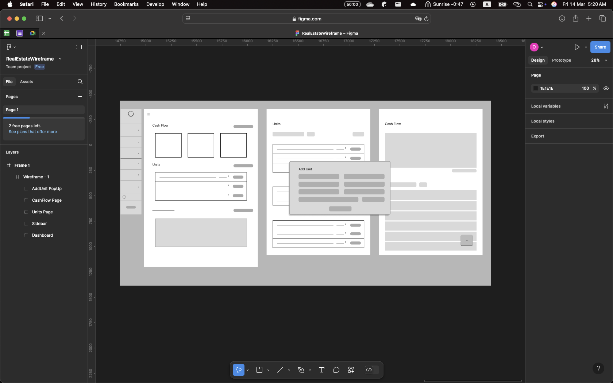

---

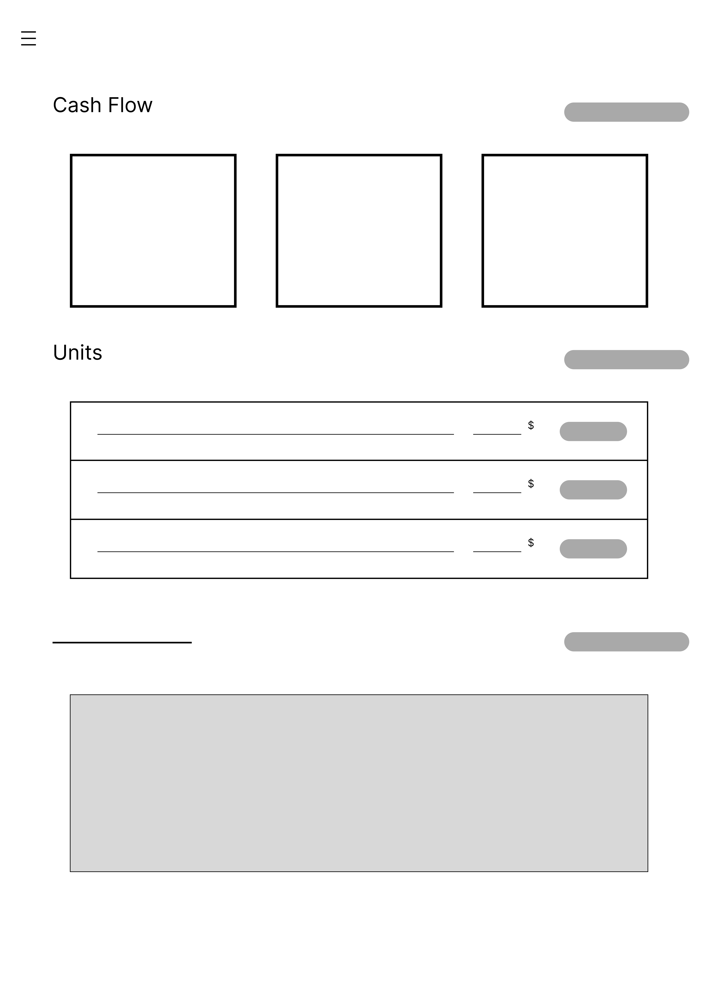

---

---

---

---

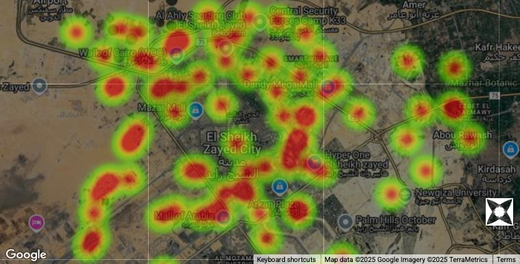

---

#### 4.1.1. GUI

- **Agent Performance Dashboard** – track agent success metrics like closed deals & response time.
- **Browse Listing** - allow agents to search and filter properties based on price, location, and status.
- **View Property Details** - provide full detailed descriptive data about the property such as location, area, status, price per m2, number of rooms, and all data related to the unit.
- **View Clients** - list all previous clients that have done any ( or none ) deals.
- **View Owners** - list all current ( and previous ) owner-property history ( past listings, sold properties, etc.. ).
- **View Deals** - list all done-deals with detailed descriptions and e-documents ( if applicable ).
- **Manage Users and Permissins** - provides a controlling interface to give/remove privilages to users.
- **Track Financial Growth** - provide a dashboard with graphs and detailed transaction processes that happened in a ssselected range of time. ( for admins only )
- **Automated Reports and Analysis** - exportable table view reporting specific action over a selected range of time.
- **Auto-messaging System** - interface for setting the message, target, and software to send the messages upon ( Whatsapp, Email, or SMS ).
- **Alerts** - recieve notifications when clients are to leave, or expiry date of the contract is about to end.
- **Alerts Management** - set and modify notifications based on user desire.
- **User-log Tracker** - list all actions (CRUDs) made by all users that affect the database. ( for admins only )
- **Interactive Maps ( Additional )** - provide visual representations of the actual area covered by the company's units. That will open up many other features in the future such as searching on the map, finding the best fit, and recommend the best area to search for units in.

Visual designs/diagrams are to be added..

#### 4.1.2. CLI

- Not applicable

#### 4.1.3. API

- **Google Maps API**
  Used to display properties on map, show streets, and calculate distances. It's for a additional features that will be published soon. One of which is the Heatmap and area coverage visualizer.
- **Google Places API**
  Used to convert unit loaction into coordinates that can be further used in visualizations.
- **Google Cloud Storage**
  Used to store photos, videos, and documents about the properties.
- **Firebase**
  Used for secure login and user authentication.
- **Google Cloud Audit Logging**
  Used to monitor user actions affectiing the database.
- **Twilio API**
  Used for auto-messaging on Whatsapp and SMS.
- **Google Sheets API**
  Used for auto report generation and exportation.

#### 4.1.4. Diagnostics or ROM

not specified yet.

### 4.2. Hardware Interfaces

- **Database Server (MySQL)**
  for storing property listings and all data.
- **Cloud Storage (Firebase)**
  for storing media and documents related to the properties.
- **Desktops & Laptops (Windows, macOS)**
  to run the web-based system.
- **Wi-Fi Routers & Internet Connectivity**
  to grant access to the system and ensure real-time accurate data.

### 4.3. Communications Interfaces

The system relies on multiple connections to ensure security and efficieny in data exchange.

- **HTTP/HTTPS**
  to ensure secure data exchange on the website.
- **Wi-Fi connectivity**
  connection to wifi is _required_ to ensure real-time accurate data and avoid conflicts and misleading non-updated data.
- **MySQL**
  connection to the database should be active during the life span of the website to ensure real-time data view.

#### Third-Parties

- **Firebase**
- **Google Maps API**
- **Googel Places API**
- **Twilio API**
- **Google Sheets API**
- **Google Cloud Audit Logging**
- **Google Cloud Storage**

### 4.4. Software Interfaces

#### Display

- **Properties**
  List all properties with short description and quick action button.
- **Clients**
  List all clients.
- **Propety-Owners**
  List all property-owners with thier properties and a short description like ( number of sold properties, location, avg cut ).
- **Deals**
  List all deals ( not completed, pending, completed ) with description of the deal.
- **Transactions**
  List all transactions of all agents and all their winnings.
- **User-Logs**
  List all user-logs and attempts to modify data that affects the database or the cloud storage or any sort of unethical attempt.
- **Users**
  List all users and accounts created with their privialges and roles assigned to them.
- **Notifications**
  Show all unread notifications and their date.

#### Track and Update Processes

- **Properties**
  follow the step-by-step approach to complete a process on the property and either set it free back or occupied if a client completes the deal.
- **Clients**
  follow the step-by-step approach while updating the status of a client and rating the procedure with that client.
- **Propety-Owners**
  follow the step-by-step approach while updating the status of the property-owner and rating the procedure with that owner.
- **Deals**
  follow the step-by-step approach then record deal state at the end (complete, incomplete).

#### Modify (Add, Edit, Delete)

- **Properties**
  add, edit or delete data about the property or even delete the property as a whole.
- **Clients**
  add, edit or delete data about a client ( except ratings are only calculated through deals ) or even delete the client himself.
- **Propety-Owners**
  add, edit or delete data about a property-owner ( except ratings are only calculated through deals ) or even delete the owner himself and his properties.
  _<blockquote>Deleting the owner results in deleting the property he currently owns, so make sure the property is assigned to the right owner before deletion.</blockquote>_
- **Deals**
  add, edit or delete data about the deal or even delete the deal itself.
  edit and delete functions are only available to admin and the roles he picks to have access.
- **Transactions**
  add, edit or delete data about transactions(income/expense) or even delete the transaction itself.
  edit and delete functions are only available to admin and the roles he picks to have access.
- **User-Logs**
  delete user-logs. only available to admins.
- **Users**
  add, edit or delete users of the website. only available to admins.
- **Notifications**
  create and edit the content, target, time, and duration of alerts.
- **Automated Messages**
  create and edit the content, target, time, and platform to send the messages upon.
- **User Privilages**
  grant and remove access to specific funtions for selected authorized roles.

#### Visualize

- **Financial State**
  visualize as graphs and cross sectors.
- **Clients Classes**
  visualize with statistical functions.
- **Market Price**
  visualize the average across years.
- **Completed Deals**
  show percentage of deal completions.
- **Coverage Area** ( additional feature )
  visualize properties on the maps with heatmap indicating coverage area of each property.

  ***

  ## 5. Performance Requirements
  The system should be designed for **high reliability** and **real-time responsiveness**. It must support simultaneous data updates from multiple users, such as agents adding new listings, brokers processing deals, and admins modifying records **without data conflicts or performance issues**.

  The system should provide live updates across all connected users. For example, when a new property is added, updated, or removed, all relevant users should see the changes immediately, without needing to refresh the page.
  Key operations, such as property search, filtering, scheduling appointments, and user authentication, must respond fast under normal load. Complex calculations—such as price valuation or deal updates be computed and displayed instantly and efficiently.
  The development process will incorporate **complexity analysis** to ensure optimal performance of algorithms handling large datasets. Additionally, the system will proceed into performance testing using industry-standard tools to test the following:

  - **Website responsiveness** across various devices and browsers
  - **Scalability** under increased user traffic
  - **User interface** simplicity, efficiency, and usability
  
  The system should be able to handle at least 100 concurrent users while maintaining smooth performance and without significant delay.

  ***

  ## 6. Design Constraints

  ### 6.1 Standard Compliance
  The system should comply with all applicable software engineering, security, and web development standards to ensure reliability, maintainability, and user trust. The following standards and guidelines will be considered during development:

  - **Web Standards Compliance**
	>The system will adhere to **the World Wide Web Consortium (W3C)** standards for **HTML5, CSS3, and JavaScript** to ensure compatibility and proper rendering across all modern web browsers.

  - **Security Standards**
	>The application will follow **OWASP** Top 10 security practices to mitigate common vulnerabilities such as SQL injection, cross-site scripting (XSS), and broken authentication.

  - **Data Privacy and Protection**
	>All user data will be handled in accordance with applicable **data protection** regulations to ensure confidentiality and user consent when collecting, storing, or processing personal information.

  - **Coding Standards**
	>The development team will follow industry-recognized clean code practices and naming conventions to ensure code readability, maintainability, and ease of collaboration.

  - **Testing Standards**
	>Unit, integration, and system testing will follow **IEEE** standards, ensuring structured and well-documented testing procedures

  ### 6.2 Hardware Limitations

  The system needs a stable setup for smooth performance. While it doesn’t require high-end hardware, some limitations should be considered:

  - **Network Dependence** - System performance maybe affected by unstable internet connections.
  - **Device Compatibility** - System requires compatible hardware for proper functioning, as mentioned in **"Section 5: Performance Requirements".**
  - **Storage Constraints** - Data growing over time may require additional cloud storage

  ***

  ## 7 Other non-functional attributes

  ### 7.1 Security

  > Only authorized SystemUsers should be able to access the system using secure login info.
  > Role-based access control which allows users to view and perform actions based on their role.
  > System must automatically log all user activites for tracking and secuirty purpose.
  > Passwords ans sensitive data must be encrypted.

  ### 7.2 **Binary Compatibility**

  > Not applicable, as the system is a web-based application and does not rely on compiled program or library.

  ### 7.3 **Reliability**

  > N/A

  ### 7.4 **Maintainability**

  > The system allows modifications to specific features without affecting the overall application.

  > The system is well-documented , including inline comments.

  > A structured developer guide is be available to support debugging, updates, and the maintenance of software standards across the project.

  ### 7.5 **Portability**

  > Not applicable, as the system runs as a web application. It is primarily designed for desktop use and does not support mobile devices.

  ### 7.6 **Extensibility**

  > The system is designed to support future improvements and updates without requiring important changes to the existing code.
  > The database is also designed in an organized and scalable manner, allowing for the addition of new tables without affecting the existing tables.

  ### 7.7 **Reusability**

  > Each UI component, including forms, buttons and navigation bars are implemented reusable modular way to maintain consistency throughout the system.
  > System Backend follows a well-structured modular implementation allowing features to be easily used accross the system.

  ### 7.8 **Application Affnity/Compatibility**

  > The system is designed to be compatible with the necessary third-parties to support the desired functionalities, including data storage, communication and location features as mentioned in **"4.1.2. API"**.

  ### 7.9 **Resource Utilization**

  > Not specified yet.

  ### 7.10 **Serviceability**

  > Not applicable, as troubleshooting is performed manually throughout the code without dedicated serviceability features such as automated alert and diagnostic tools.

  ***

## 8. Preliminary Object-Oriented Domain Analysis

  ### 8.1. Inheritance Relationships

  <table border="3">
    <tr>
      <th></th>
      <th>User Class</th>
      <th>Property Class</th>
      <th>Deal Class</th>
      <th>Transaction Class</th>
    </tr>
    <tr>
      <th>Diagram</th>
      <td></td>
      <td></td>
      <td></td>
      <td>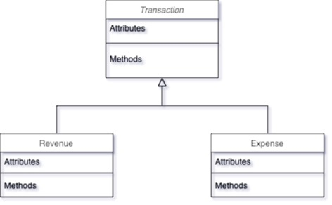</td>
    </tr>
    <tr>
      <th>Parent Classes</th>
      <td>User</td>
      <td>Property</td>
      <td>Deal</td>
      <td>Transaction</td>
    </tr>
    <tr>
      <th>Inhereted Classes</th>
      <td>
        <ul>
          <li>SystemUser</li>
          <li>ExternalUser</li>
        </ul>
      </td>
      <td>
        <ul>
          <li>House</li>
          <li>Apartment</li>
          <li>Studio</li>
          <li>Office</li>
          <li>Land</li>
        </ul>
      </td>
      <td>
        <ul>
          <li>RentingDeal</li>
          <li>SellingDeal</li>
        </ul>
      </td>
      <td>
        <ul>
          <li>Revenue</li>
          <li>Expense</li>
        </ul>
      </td>
    </tr>
  </table>

  ### 8.2. Class descriptions

  #### 8.2.1. Class Name

  - **User**

    > an **abstract** class that represents anyone using the system.

  - **ExternalUser**

    > is-a **User** that has **no-permissions** to view, modify, or update anything on the system.
	> has-a **Buyer**, **Seller**, **Client**, or **Owner** profile.

  - **Buyer**

    > is-a **ExternalUser** who has already purchased or rented a property.

  - **Seller**

    > is-a **ExternalUser** who owns(or transferred the ownership in case of selling not renting) a property and has already sold it or rented it.

  - **Client**

    > is-a either **Seller** or **Buyer** or possibly both.

  - **Owner**

    > is-a either **Seller** or **Buyer** or possibly both.
    > has-a **Property**.

  - **SystemUser**

    > is-a **User** who has-a **Role**(s) and has rights to modify or update specific parts of the system or to perform operations.

  - **Role**

    > has-a set of **Permissions** assigned to a **SystemUser**.

  - **Permissions**

    > an **stand-alone** class that specifies a set of operational rights assigned to **SystemUser**.

  - **Property**

    > an **abstract** class represents a real estate
    > asset that can be bought, sold, or rented.

  - **House**

    > is-a **Property** representing a residential building designed for living.

  - **Apartment**

    > is-a **Property** that is a unit within a larger residential complex.

  - **Office**

    > is-a **Property** that is used for commercial and business purposes.

  - **Studio**

    > is-a Property representing a small, self-contained living space typically designed for a single occupant.

  - **Deal**

    > an **abstract** representing a contractual agreement between a buyer and seller.

  - **RentingDeal**

    > is-a **Deal** that involves leasing a Property for a specific duration

  - **SellingDeal**

    > is-a **Deal** where ownership of a Property is transferred.

  - **Transaction**

    > an **abstract** class representing financial activities related to deals and payments.

  - **Revenue**
    > is-a **Transaction** that records incoming financial gains.
  - **Expense**

    > is-a **Transaction** that tracks outgoing costs.

  - **StatisticalAnalysis**

    > has-a **Deal** and **Transaction**, analyzing financial transactions.

  - **Report**

    > a **stand-alone** class used for generating insights from **StatisticalAnalysis** class.

  - **AuditLog**

    > a **stand-alone** class records system activities and tracks modifications for security.

  - **Message**

    > a **stand-alone** class used for communication between **SystemUser** and **ExternalUser**.

  - **Notification**
    > a **stand-alone** class used to notify **SystemUsers** with alerts.

  #### 8.2.2. List of Standalone Classes

  - **Buyer**
  - **Seller**
  - **Client**
  - **Owner**
  - **Role**
  - **Permission**
  - **Notification**
  - **Appointment**
  - **Messages**
  - **StatisticalAnalysis**
  - **Report**
  - **AuditLog**
  - **GUI**
  - **Query**
  - **JSONCoder**

  #### 8.2.3. List of Superclasses

  - **User**
  - **Property**
  - **Deal**
  - **Transaction**

  #### 8.2.4. List of Subclasses

  ###### User

  - **ExternalUser**
  - **SystemUser**

  ###### Property

  - **House**
  - **Apartment**
  - **Studio**
  - **Office**
  - **Land**

  ###### Deal

  - **RentingDeal**
  - **SellingDeal**

  ###### Transaction

  - **Revenue**
  - **Expense**

  #### 8.2.5. Purpose

  - **User**

    > Defines the base entity for all internal/external users and provides authentication and identity management for system users.

  - **ExternalUser**

    > Represents Users who do not have internal system permissions or viewing access i.e. Clients, Property-Owners, Buyers, and Sellers.

  - **Authentication**

    > Ensures secure access to the system with valid database authentication and manages user sessions throughout the system lifespan.

  - **Buyer**

    > The buyer/renter side of the deal that contributes in the **deal** completion. In case of Selling Deal, the ownership of the property transfers **to** him.

  - **Seller**

    > The current owner of the property that contributes in the **deal** completion. In case of Selling Deal, the ownership of the property is transferred **from** him.

  - **Client**

    > An **ExternalUser** who is seeking help to find the appropriate unit (property) either for linving or invve

  - **Owner**

    > The current owner/seller of a property who is looking for an **ExternalUser** who is intersted in buying/renting a property. He seeks help to market for his properties.

  - **SystemUser**

    > represents the active **User** who can view, interact, and perform operations based on an assigned role.

  - **Role**

    > represents set of permissions assigned to **SystemUsers** to perform specific operations.

  - **Permissions**

    > Specifies **User** privileges within the system that limits his access to certain operations which eventually boosts confidentiality of the Company and enhances security by preventing unauthorized access.

  - **Property**

    > is the main object in the business which deals and all operations relies upon. It's also referred to as **Unit**. Property defines every physical or legal asset that can be owned, rented, or sold. It includes, Land, House, Apartment, Studio, and Office. Properties are stored in the system only if documents are proven to be legal and valid. Each property has its own pricing that is given from the owner to market it for.

  - **House**
  - > is-a type of **property** that is a building with one owner and has no more than one family living in it.

  - **Apartment**

    > is-a type of **property** that is a part of a building and has only one owner to it.

  - **Office**

    > is-a type of **property** that is smaller than a studio and is mostly used for commercial use.

  - **Studio**

    > is-a type of **property** that can be shared and is usually rented and not sold.

  - **Land**

    > is-a type of **property** that refers to a wide land area that is used for constructions and building needs.

  - **Deal**

    > Ensures structured excution of transactions when agreement is reached between the **Buyer** & **Seller**. It standardize the process by defining clear terms and conditions. It is also associated with a financial operation such as **transaction** and **document**.

  - **RentingDeal**

    > provides a well-oragnized excution of property leasing agreement when terms are agreed between the **Client** & **Broker**. It standardize the rental process by definig clear rental terms and payment schedules. protecting the rights of both parties and minimizing conflicts. It is also associated with a financial operation such as **transaction** and **document**.

  - **SellingDeal**

    > Provides a well-organized execution of property sales agreements when terms are agreed between the **Buyer** & **Seller**. It standardizes the selling process by defining clear ownership transfer conditions and legal documentation. by protecting the rights of both parties, preventing any conflicts and ensuring a clear transition of property ownership. It is also associated with financial operations such as **transaction** and **document**.

  - **Transaction**

    > Represents the financial aspects and flow of a deal. It ensures security and transparent payments between parties and prevents any conflicts.

  - **Revenue & Expense**

    > Categorizes financial transactions into income and costs.

  - **StatisticalAnalysis**

    > Used for processing financial data related to **deals** and **transactions** providing insights into **revenue**, **expense** and overall performance. It enhances decision making for **SystemUsers**.

  - **Report**

    > Reports is generated based on **StatisticalAnalysis** insights, providing **SystemUsers** clear view of financial performance. It helps in decision making by providing revenue and expenses detailed reports.

  - **AuditLog**

    > Maintains a detailed record of all system modifications, tracking changes made by **Users**. This helps in maintaing transparency within the system.

  - **Message**

    > provides clear automated messaging system between **ExternalUsers** & **SystemUsers** within the system.

  - **Notification**

    > Real-time alerts and updates to **SystemUsers** Helping them to stay informed about important (deals) events. It enhances responsiveness by providing critical reminders and notifications

  - **Appointment**
    > Manages property visit schedules for potential buyers and **SystemUsers**.

  #### 8.2.6. Collaborations
- 1.
  

---
- 2.
  

---
- 3.
  

---
- 4.
  

---

- 5.

  

---
- 6.
  

---

- 7.

  

---
- 8.
  

---

- 9.

  

---

  #### 8.2.7. Attributes
  ##### User
  - First name
  - Last name
  - Country_Code
  - Phone_number
  ##### System User
  - Email
  - Password
  - ID
  - Role
  ##### External User
  - Rating
  ##### Buyer
  - ID
  - SSN
  - Area
  - Category
  - PropertyID
  - DealID
  ##### Seller
  - ID
  - SSN
  - Area
  - PropertyID
  - DealID
  ##### Client
  - NeedPropertyFeatures
  - ProvidePropertyFeatures
  ##### Owner
  - ID
  - PropertyIDs
  ##### Property
  - forRent
  - forSale
  - ID
  - price
  - paidAmount
  - remainingAmount
  - myCut
  - status
  - latitude
  - longitude
  - AreaCoverage
  - area
  - address
  - listingDate
  - mediaLink
  - is_installment_available (bool)
  - installment_duration_months
  - down_payment
  - monthly_payment
  - interest_rate
  - payment_start_date
  ##### House
  - number_of_bedrooms
  - number_of_bathrooms
  - has_garage (bool)
  - has_garden (bool)
  - number_of_floors
  - year_built
  - heating_type (central, gas, electric)
  - cooling_type
  - furnished (bool)
  - backyard_size
  - flooring_type
  - roof_type
  - has_landline
  - network_infrastructure
  ##### Apartment
  - unit_number
  - floor_number
  - number_of_bedrooms
  - number_of_bathrooms
  - building_name
  - has_elevator
  - monthly_maintenance_fee
  - is_furnished
  - has_balcony
  - view_type
  - network_infrastructure
  - has_landline
  ##### Studio
  - floor_number
  - is_furnished
  - has_kitchenette (bool)
  - has_balcony
  - apartment_name
  - monthly_maintenance_fee
  - network_infrastructure
  - has_landline
  ##### Office
  - floor_number
  - building_name
  - number_of_rooms
  - meeting_rooms
  - has_reception_area
  - has_parking
  - monthly_service_fee
  - is_furnished
  - network_infrastructure (bool)
  - has_landline
  ##### Land
  - land_type (e.g., residential, commercial, agricultural)
  - zoning_information
  - is_serviced (utilities available)
  - buildable_area
  - plot_number
  - topography (flat, slope, etc.)
  - road_access

  ##### Deal
  - ID
  - PropertyID
  - SellerID
  - BuyerID
  - SysUserID
  - Date
  ##### RentingDeal
  - startDate
  - endDate
  - securityAmount
  - monthlyRent
  - paymentFrequency
  - leaseDuration
  - utilitiesIncluded(Electricity, Water, Gas)
  - rentalConditions
  ##### SellingDeal
  - askingPrice
  - valuationPrice
  - finalPrice
  - negotiable
  - paid
  - commissionRate
  - paymentType
  - ownershipType
  - legalClearance
  - propertyTitleDeed
  ##### Role
  - name
  - ID
  - permissions
  ##### Permissions
  - ID
- ###### The following is to be discussed with the client
  - can_view..
  - can_edit..
  - can_create..
  - can_delete..
  - can_import..
  - can_export..
  
  ##### GUI
  - isVisible
  - height
  - width
  - color
  - order
  - isPinned
  
  ##### Query
  - operation
  - realtionType
  - relationName
  - values
  - constraints
  - result
  
    ##### Notification
  - date
  - title
  - body
  - isRead
  - isPinned
  
    ##### Appointment
  - date
  - broker
  - client
  - property
  - location
  - scheduledTime
  - status
  
    ##### StatisticalAnalysis
  - ID
  - type
  - targetEntity
  - metrics
  - filtersApplied
  - startDate
  - endDate
  - summary
  - chartType
  
    ##### Messages
  - ID
  - title
  - body
  - messagingPlatform
  - scheduledTime
  - sender
  
    ##### AuditLog
  - time
  - user
  - action
  
    ##### Report
  - ID
  - title
  - description
  - generatedBy
  - generatedAt
  - type
  - format
  - filePath
  - status
  - reviewedAt

  #### 8.2.8. Operations
  #####  User
  - login()
  - logout()
  - updateProfile()

  ##### System User
  - assignRole()
  - createExternalUser()
  - createProperty()
  - scheduleAppointment()
  - viewAuditLog()

  ##### External User
  - viewProfile()
  - viewDeals()
  - viewOwnedProperties()
  - banUser()
  - requestVisit()

  ##### Buyer
  - requestVisit()
  - viewPurchaseHistory

  ##### Seller
  - viewListedProperties()
  - viewSalesHistory()

  ##### Client
  - matchWithAvailableProperties()

  ##### Owner
  - updateOwnership()
  - viewOwnedProperties()

  ##### Property
  - getPropertyFeatures()
  - isAvailable()
  - markAsSold()
  - markAsRented()
  - getOwnerDetails()
  - assignToOwner()
  - attachDocuments()

  ##### Deal
  - validateDeal()
  - finalizeDeal()
  - cancelDeal()

  ##### RentingDeal
  - calculateTotalRent()
  - extendLease()
  - terminateLease()
  - setRentalTerms()

  ##### SellingDeal
  - finalizePayment()

  ##### Role
  - assignPermissions()
  - updatePermissions()
  - listAssignedUsers()
  - removeRole()
  - createRole()
  
  #### Appointment
  - scheduleVisit()
  - rescheduleVisit()
  - cancelVisit()
  - assignToSystemUser()

  #### Notifiction
  - createNotification()
  - sendToUser()
  - markAsRead()

  #### Message
  - createMessage()
  - sendMessage()

  ### 8.2.9. Constraints

  #### User

  > **Must** be associated with at least one subclass (SystemUser or ExternalUser).
  > **Cannot** exist without first and last name.
  > **Must** have a unique phone number and country code combination.

  #### SystemUser

  > **Must** have a unique username and password.
  > **Must** be assigned at least one **Role**.

  #### ExternalUser

  > **Can only** be created or updated by a **SystemUser**
  > Cannot log in or access the system
  > **Must** be associated with at least one profile type : **Buyer**, **Seller**, **Client** or **Owner**

  #### Buyer

  > **Can only** be assigned properties through a valid **Deal**.
  > SSN **must** be unique.

  #### Seller

  > **Must** have a **Property** ownership before initiating a sale

  #### Owner

  > **Must** be linked to at least one **Property**

  #### Client

  > **Must** provide at least one **NeedPropertyFeatures** entry

  #### Property ( all types )

  > **Must** have a unique ID
  > **Cannot** be marked as for sale and for rent at the same time.
  > **Must** have valid legal documents uploaded before being listed.
  > Latitude and longitude must be **valid** coordinates.
  > **Cannot** have negative area or coverage.
  > Price **must** be greater than 0.

  #### Deal

  > **Buyer** and **Seller** **must** be distinct
  > **Property** can only be involved in one active **Deal** at a time

  #### Renting Deal

  > Lease duration **must** be ≥ 1 month
  > Monthly rent **must** be > 0.
  > Start date **must precede** end date

  #### Selling Deal

  > Asking price, valuation price, and final price **must** all be > 0
  > Ownership cannot transfer **without** legal clearance

  #### Transaction

  > **Must** be linked to a valid deal

  #### Role

  > **Must** have at least one permission assigned.
  > Name **must** be unique

  #### Notification

  > **Must** have a **valid** recipient

  #### Appointment

  > **Cannot overlap** with another appointment for the same **Property**.
  > **Must** be linked to a _SystemUser_, **Client** and a **Property**.

  #### AuditLog

  > Cannot be modified after creation
  > **Must** include a timestamp, actor, and action

---

## 9. Operational Scenarios
 
 This section describes different  scenarios for how the broker system will work in different situations. Each scenario is presented in both use case and script  .
 
 

	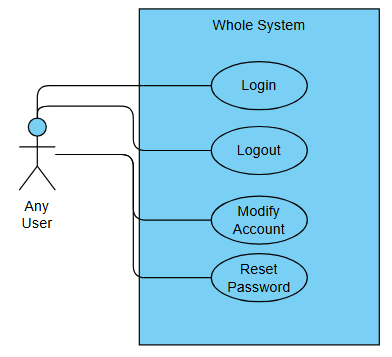
	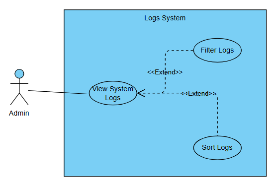
	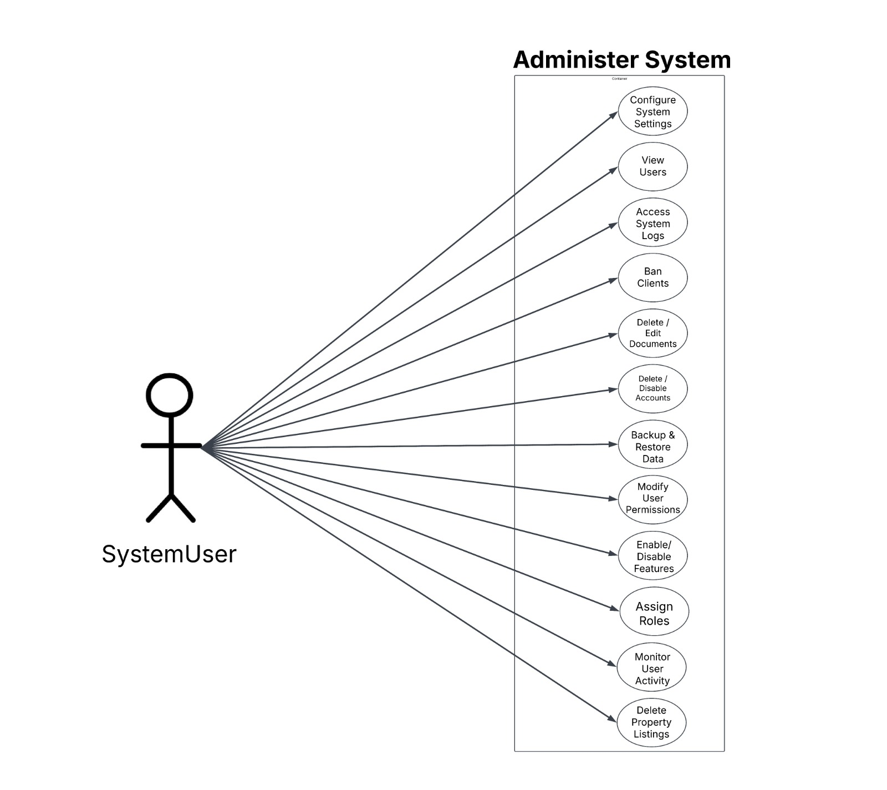
	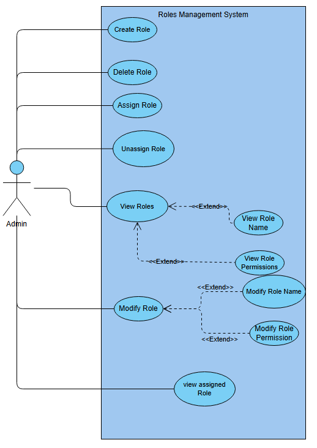
	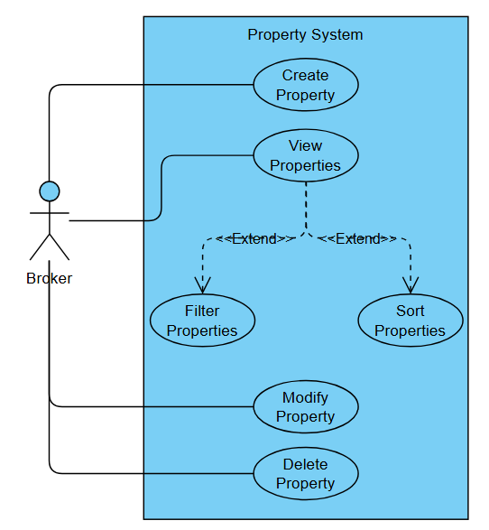
	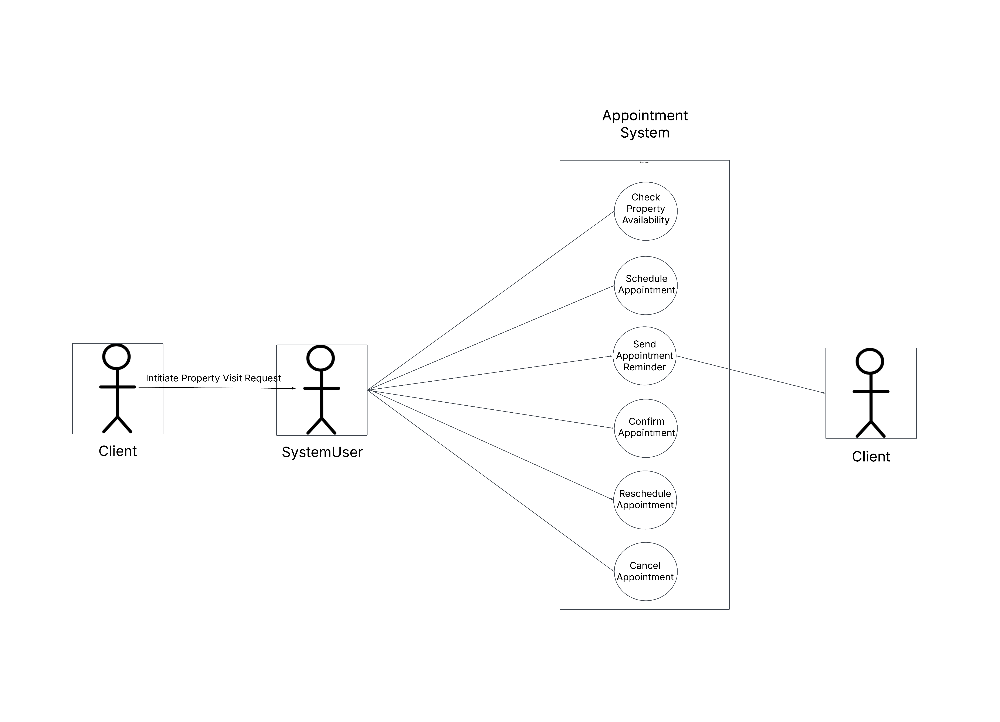
	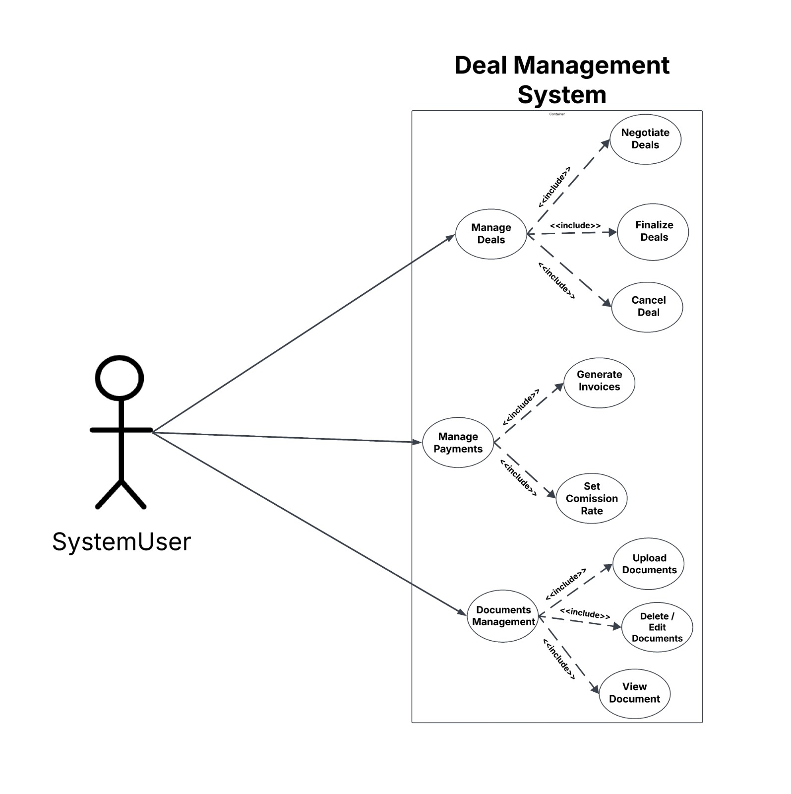
 

 
 ---
 ### Use Case 1 – A customer buys a property
 *ID:* MBS-001  
 *Title:* Buying a property  
 *Actors:*  Customer ,Broker, Owner  
 *Required:* The customer is registered and has selected a property.  
 *Description:* Once the customer has chosen a property, the broker works with the owner to process the purchase request. The broker schedules a meeting and follows all necessary .  
 *Result:* The purchase is confirmed and recorded in the system.
 
 
 ### Script
 | Step | Action                               | Agent        |
 |------|--------------------------------------|--------------|
 | 1    | Broker reviews and selects the property | Broker       |
 | 2    | Broker starts the purchase request   | Broker       |
 | 3    | A meeting is scheduled with the owner | Broker       |
 | 4    | Broker ensures the owner accepts and attends the meeting | Broker |
 | 5    | The owner attends the meeting and agrees | Owner        |
 | 6    | Broker manages the signing of the digital agreement | Broker |
 | 7    | Broker records the transaction           | Broker       |
 | 8    |  The system sent the confirmation.      | System       |
 
 
 ---
 
 ## Use Case 2 – Client Rents a Property
 
 *ID:* MBS-002  
 *Title:* Property Rental  
 *Actors:* Customer, Broker, Owner  
 *Required:* The unit is available for rent.  
 *Description:* The client selects a rental property, deals with the owner through a broker, and signs a digital rental contract.  
 *Rrsult* The rental agreement is saved, and follow-up notifications are scheduled.
 <!-- el owner hena = someone wants to sell his property-->
 
 ### Script
 
 | Step | Action                                  | Agent        |
 |------|-----------------------------------------|--------------|
 | 1    |   Broker selects available rental properties for the client  | Broker       |
 | 2    | Broker reviews details  and price | Broker    |
 | 3    | Broker arranges rental request and schedules a meeting | Broker |
 | 4    | Broker contacts the owner to confirm agreement | Broker |
 | 5    | Broker prepares the digital rental contract | Broker    |
 | 6    | Broker ensures that both client and owner sign the agreement| Broker |
 | 7    | System stores the agreements             | System       |
 | 8    | System sends rent reminders             | System       |
 
 
 ---
 
 ## Use Case 3 – Owner (Admin) Registers a New Property
 
 *ID:* MBS-003  
 *Title:* Property Registration  
 *Actors:* Owner, Broker (employee)
 *Required:* The owner or broker(employee) records the data and ditails of property in the sysytem.  
 *Description:* The owner or broker submits property details and required documents, which are reviewed by the broker .  
 *Result:* The property appears in search results.
 
 ### Script
 
 | Step | Action                                                              | Agent         |
 |------|---------------------------------------------------------------------|---------------|
 | 1    | Owner or employee logs in to the platform                           | Owner/Employee|
 | 2    | Fill in property information                                        | Owner/Employee|
 | 3    | Upload documents that include information about the property        | Owner         |
 | 4    | Broker makes the list of properties                          | Broker        |
 | 5    | Property becomes available for rent or sale                        | System        |
 
 
 ## Use Case 4 – Maintenance and Follow-up for Rented Unit
 
 *ID:* MBS-004  
 *Title:* Rental Maintenance  
 *Actors:* Client, Broker, Owner  
 *Required:* Problems are reported once the property is rented
 
 *Description:* The broker works with the owner to resolve maintenance issues that are reported by the client .  
 *Result:* Issues are resolved and tracked.
 
 ### Script
 
 | Step | Action                                          | Agent        |
 |------|-------------------------------------------------|--------------|
 | 1    | Client calls or reports the problem             | Client       |
 | 2    | Broker reviews the issue and contacts the owner | Broker       |
 | 3    | Owner tries to solve the problem                | Owner        |
 | 4    | Broker confirms the issue resolution with client| Broker       |
 | 5    | Broker marks the issue as resolved              | Broker       |
 <!-- i don't know if i should to make use case 5 , it will be about rating-->

## 10. Preliminary Schedule Adjusted

 The detailed project schedule is yet to be finalized.

## 11. Preliminary Budget Adjusted

No Budget has been allocated.

## 12. Appendices

### 12.1 Definitions, Acronyms, and Abbreviations

>     This section provides the definitions of terms, acronyms, and abbreviations used throughout this Software Requirements Specification (SRS) document to ensure clarity and understanding.

<table border="1" cellpadding="8" cellspacing="0">
  <thead>
    <tr>
      <th>Term</th>
      <th>Definition</th>
      <th>Notes</th>
    </tr>
  </thead>
  <tbody>
    <tr>
      <td>SRS</td>
      <td>Software Requirements Specification</td>
      <td>This document itself</td>
    </tr>
    <tr>
      <td>UI</td>
      <td>User Interface</td>
      <td>The graphical interface users interact with</td>
    </tr>
    <tr>
      <td>DB</td>
      <td>Database</td>
      <td>Stores system data such as users, properties, and transactions</td>
    </tr>
    <tr>
      <td>CRUD</td>
      <td>Create, Read, Update, Delete</td>
      <td>Basic operations on system data</td>
    </tr>
    <tr>
      <td>Admin</td>
      <td>Administrator</td>
      <td>Full access and control over system functions</td>
    </tr>
    <tr>
      <td>Broker</td>
      <td>Real Estate Agent</td>
      <td>Handles deals and connects owners with buyers</td>
    </tr>
    <tr>
      <td>Client</td>
      <td>System User (Buyer or Renter)</td>
      <td>Interested in renting or buying properties</td>
    </tr>
    <tr>
      <td>ID</td>
      <td>Identifier</td>
      <td>Unique value for entities like users or properties</td>
    </tr>
    <tr>
      <td>AWS</td>
      <td>Amazon Web Services</td>
      <td>Used for hosting or document storage</td>
    </tr>
    <tr>
      <td>MySQL</td>
      <td>Structured Query Language-based Database</td>
      <td>Used to store and manage system records</td>
    </tr>
    <tr>
      <td>API</td>
      <td>Application Programming Interface</td>
      <td>Facilitates integration with other platforms</td>
    </tr>
    <tr>
      <td>Luxville</td>
      <td>Real Estate Company</td>
      <td>The business entity that owns the system</td>
    </tr>
    <tr>
      <td>CRUD</td>
      <td>Create, Read, Update, Delete – the four basic functions of persistent storage</td>
      <td>Common operations in database and system management</td>
    </tr>
    <tr>
      <td>Excel</td>
      <td>A spreadsheet software by Microsoft used for data management</td>
      <td>Often used to prepare/import bulk data into the system</td>
    </tr>
    <tr>
      <td>Accounts</td>
      <td>Registered user profiles in the system</td>
      <td>Represents system users with login credentials</td>
    </tr>
    <tr>
      <td>Permissions</td>
      <td>System access rights based on the user's role</td>
      <td>Controls what a user is allowed to do in the system</td>
    </tr>
    <tr>
      <td>System</td>
      <td>The software platform defined by this requirements document</td>
      <td>Refers to the real estate management solution as a whole</td>
    </tr>
    <tr>
      <td>User Interface</td>
      <td>The visual component of the system that users interact with</td>
      <td>Includes screens, forms, buttons, and navigations</td>
    </tr>
    <tr>
      <td>GUI</td>
      <td>Graphical User Interface</td>
      <td>The interface users interact with visually</td>
    </tr>
    <tr>
      <td>API</td>
      <td>Application Programming Interface</td>
      <td>Used to integrate with external services and tools</td>
    </tr>
    <tr>
      <td>Google Places API</td>
      <td>Location Data API</td>
      <td>Used to convert locations into coordinates</td>
    </tr>
    <tr>
      <td>Google Cloud Storage</td>
      <td>Cloud File Storage Service</td>
      <td>Stores media and documents</td>
    </tr>
    <tr>
      <td>Firebase</td>
      <td>Google Backend Platform</td>
      <td>Handles login and authentication</td>
    </tr>
    <tr>
      <td>Google Cloud Audit Logging</td>
      <td>Monitoring and Audit Service</td>
      <td>Used to track user activity affecting data</td>
    </tr>
    <tr>
      <td>Twilio API</td>
      <td>Messaging API</td>
      <td>Used to send automated messages via SMS or WhatsApp</td>
    </tr>
    <tr>
      <td>Google Sheets API</td>
      <td>Spreadsheet API</td>
      <td>Used to generate/export reports</td>
    </tr>
    <tr>
      <td>HTTP/HTTPS</td>
      <td>Hypertext Transfer Protocol / Secure</td>
      <td>Ensures secure data exchange</td>
    </tr>
    <tr>
      <td>Logs</td>
      <td>Activity Records</td>
      <td>Track actions performed by users in the system</td>
    </tr>
    <tr>
      <td>Cloud</td>
      <td>Remote Server-Based Services</td>
      <td>Used for media/document storage and authentication</td>
    </tr>
    <tr>
      <td>User</td>
      <td>An abstract class that represents anyone using the system.</td>
      <td>Superclass for all user types</td>
    </tr>
    <tr>
      <td>ExternalUser</td>
      <td>User with no system permissions.</td>
      <td>Can be a Buyer or Seller</td>
    </tr>
    <tr>
      <td>Buyer</td>
      <td>An ExternalUser who has purchased/rented a property.</td>
      <td>Subclass of ExternalUser</td>
    </tr>
    <tr>
      <td>Seller</td>
      <td>An ExternalUser who owns or has sold/rented a property.</td>
      <td>Subclass of ExternalUser</td>
    </tr>
    <tr>
      <td>Owner</td>
      <td>Buyer/Seller who has property(ies).</td>
      <td>Has-a Property</td>
    </tr>
    <tr>
      <td>SystemUser</td>
      <td>User with assigned Role(s).</td>
      <td>Can perform system operations</td>
    </tr>
    <tr>
      <td>Role</td>
      <td>A set of permissions assigned to SystemUser.</td>
      <td>Used to control access</td>
    </tr>
    <tr>
      <td>GeneralPermissions</td>
      <td>Basic privileges for Users.</td>
      <td>Like viewing dashboards</td>
    </tr>
    <tr>
      <td>OperationalPermissions</td>
      <td>Business-related operation privileges.</td>
      <td>Includes negotiation and document actions</td>
    </tr>
    <tr>
      <td>AdminstrativePermissions</td>
      <td>Privileges for managing system settings and users.</td>
      <td>Only for Admins/Managers</td>
    </tr>
    <tr>
      <td>FinancialPermissions</td>
      <td>Access to financial operations and reports.</td>
      <td>Includes viewing/exporting reports</td>
    </tr>
    <tr>
      <td>MarketingPermissions</td>
      <td>Privileges for alerts and automated messaging.</td>
      <td>Used for client communication</td>
    </tr>
    <tr>
      <td>Apartment</td>
      <td>Unit in a residential building.</td>
      <td>Owned individually</td>
    </tr>
    <tr>
      <td>Studio</td>
      <td>Self-contained small living unit.</td>
      <td>Typically for renting</td>
    </tr>
    <tr>
      <td>Office</td>
      <td>Property used for business/commercial purposes.</td>
      <td>Includes meeting rooms, reception</td>
    </tr>
    <tr>
      <td>Deal</td>
      <td>Abstract class for agreements between buyer & seller.</td>
      <td>Superclass of Renting/Selling Deal</td>
    </tr>
    <tr>
      <td>RentingDeal</td>
      <td>Lease agreement for a Property.</td>
      <td>Includes rental terms</td>
    </tr>
    <tr>
      <td>SellingDeal</td>
      <td>Ownership transfer deal for a Property.</td>
      <td>Includes legal documents</td>
    </tr>
    <tr>
      <td>Transaction</td>
      <td>Abstract class for financial activities.</td>
      <td>Superclass for Revenue and Expense</td>
    </tr>
    <tr>
      <td>Revenue</td>
      <td>Incoming financial gain.</td>
      <td>Subclass of Transaction</td>
    </tr>
    <tr>
      <td>Expense</td>
      <td>Outgoing cost.</td>
      <td>Subclass of Transaction</td>
    </tr>
    <tr>
      <td>StatisticalAnalysis</td>
      <td>Analyzes Deal and Transaction data.</td>
      <td>Used for performance insights</td>
    </tr>
    <tr>
      <td>AuditLog</td>
      <td>Tracks system activity and changes.</td>
      <td>Used for transparency and security</td>
    </tr>
    <tr>
      <td>Appointment</td>
      <td>Manages property visit schedules.</td>
      <td>Standalone class</td>
    </tr>
    <tr>
    <td>Query</td>
    <td>Handles data retrieval based on filters and search inputs.</td>
    <td>Used internally to perform database operations efficiently.</td>
  </tr>
  <tr>
    <td>JSONCoder</td>
    <td>Responsible for encoding and decoding data in JSON format.</td>
    <td>Utility class used for serialization and data transfer.</td>
  </tr>
  </tbody>
</table>
