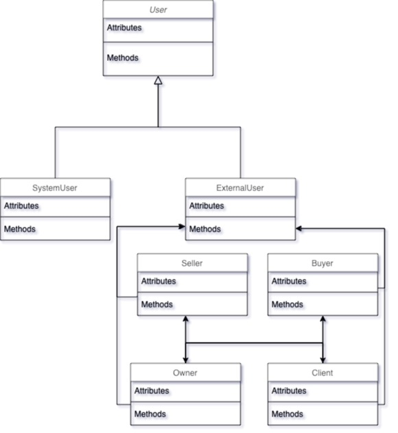
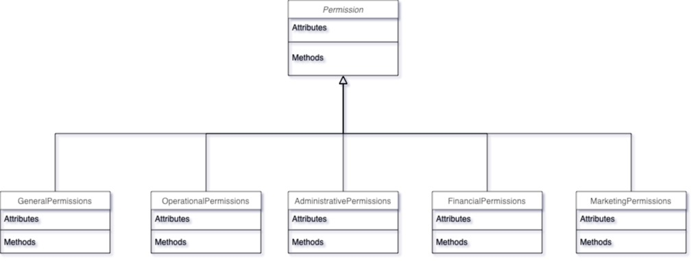
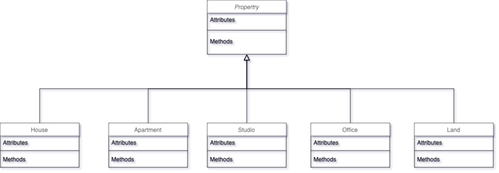
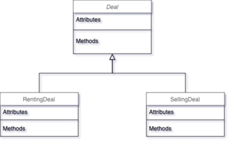
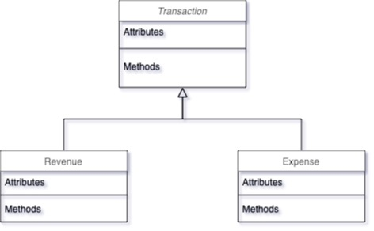

# Real Estate Management System

## 1. Introduction
### 1.1 Purpose of this Document
This document is mainly for the current (and future) developers of **The Real Estate Management System**. This document focuses on describing each and every aspect in the system so that future updates and maintanance can easily be applied without any contradictions.
### 1.2 Scope of this Document
This document covers everything from *A* to *Z* . It covers the business model and its processes to the enhancements made with the software development and every update happened on the system. It also includes technical and non-technical descriptions about the business and the software. All the team members participated in building this document on differnet approaches from collectiong data and meets with the client to formatting the document to be on this organized form. This document is written in **Markdown** Language (.md) and that's to ensure readability on virtual platforms i.e. Github. The first release of this document was before the launch of the software so future updates and changes in the document may occur.
### 1.3 Overview
**Real Estate Management System** is a web-based system that allows Real Estate Agents to easily manage the units and customer needs. The system provides an interface for agents to easily communicate and arrange deals with owners and buyers. Agents can view their units, clients, and owners. They also have access to a dashboard to track financial growth and unit status, location, and details.

**Key features include:**
- **Listing Properties**
  - Add new properties for rent or sale.
  - Update property status (available, sold, or rented).
- **Managing Deals**
  - Track property status and transactions.
  - Follow up with clients until unit handover.
- **Commission & Payments**
  - Monitor financial transactions and commissions.
  - Manage rent payments and revenue tracking.
- **Automated Messaging System**
  - Message customers (non-buyers) for units availability.
  - Message Investors and Businessmen for available properties.

### 1.4 Business Context
**Luxville** is sponsoring the production of this model, as all information and business requirements are mostly captured from this company. 
**Business Mission:**
  - **Provide** the most suitable **property**(unit) for **customers** based on budget, location, and preferences
  - **Market** properties on behalf of owners
  - **Connect** **owners** with **buyers**.
  
**Organizational Objectives:** 
**Expand their market reach** while **maintaining an organized and efficient approach** of **deal managament** with **high user satisfaction**. Currently their real estate operations are focused on 6th of October city. However, their long-term plan is to scale operations to cover Sheikh Zayed, New Cairo (Tagamoa), and expand across Egypt.

---

## 4. Interface Requirements
### 4.1. User Interfaces
#### 4.1.1. GUI
- **Agent Performance Dashboard** – track agent success metrics like closed deals & response time.
- **Browse Listing** - allow agents to search and filter properties based on price, location, and status.
- **View Property Details** - provide full detailed descriptive data about the property such as location, area, status, price per m2, number of rooms, and all data related to the unit.
- **View Clients** - list all previous clients that have done any ( or none ) deals.
- **View Owners** - list all current ( and previous ) owner-property history ( past listings, sold properties, etc.. ).
- **View Deals** - list all done-deals with detailed descriptions and e-documents ( if applicable ).
- **Manage Users and Permissins** - provides a controlling interface to give/remove privilages to users.
- **Track Financial Growth** - provide a dashboard with graphs and detailed transaction processes that happened in a ssselected range of time. ( for admins only )
- **Automated Reports and Analysis** - exportable table view reporting specific action over a selected range of time.
- **Auto-messaging System** - interface for setting the message, target, and software to send the messages upon ( Whatsapp, Email, or SMS ).
- **Alerts** - recieve notifications when clients are to leave, or expiry date of the contract is about to end.
- **Alerts Management** - set and modify notifications based on user desire.
- **User-log Tracker** - list all actions (CRUDs) made by all users that affect the database. ( for admins only )
- **Interactive Maps ( Additional )** - provide visual representations of the actual area covered by the company's units. That will open up many other features in the future such as searching on the map, finding the best fit, and recommend the best area to search for units in.

Visual designs/diagrams are to be added..
#### 4.1.2. API
- **Google Maps API**
  Used to display properties on map, show streets, and calculate distances. It's for a additional features that will be published soon. One of which is the Heatmap and area coverage visualizer.
- **Google Places API**
  Used to convert unit loaction into coordinates that can be further used in visualizations.
- **Google Cloud Storage**
  Used to store photos, videos, and documents about the properties.
- **Firebase**
  Used for secure login and user authentication.
- **Google Cloud Audit Logging**
  Used to monitor user actions affectiing the database.
- **Twilio API**
  Used for auto-messaging on Whatsapp and SMS.
- **Google Sheets API**
  Used for auto report generation and exportation.
#### 4.1.3. Diagnostics or ROM
  not specified yet.
### 4.2. Hardware Interfaces
- **Database Server (MySQL)**
  for storing property listings and all data.
- **Cloud Storage (Firebase)**
  for storing media and documents related to the properties.
- **Desktops & Laptops (Windows, macOS)**
  to run the web-based system.
- **Wi-Fi Routers & Internet Connectivity**
  to grant access to the system and ensure real-time accurate data.
  
### 4.3. Communications Interfaces
The system relies on multiple connections to ensure security and efficieny in data exchange.
- **HTTP/HTTPS**
  to ensure secure data exchange on the website.
- **Wi-Fi connectivity**
  connection to wifi is *required* to ensure real-time accurate data and avoid conflicts and misleading non-updated data.
- **MySQL**
  connection to the database should be active during the life span of the website to ensure real-time data view.
#### Third-Parties
- **Firebase**
- **Google Maps API**
- **Googel Places API**
- **Twilio API**
- **Google Sheets API**
- **Google Cloud Audit Logging**
- **Google Cloud Storage**
### 4.4. Software Interfaces
#### Display
- **Properties**
  List all properties with short description and quick action button.
- **Clients**
  List all clients.
- **Propety-Owners**
  List all property-owners with thier properties and a short description like ( number of sold properties, location, avg cut ).
- **Deals**
  List all deals ( not completed, pending, completed ) with description of the deal.
- **Transactions**
  List all transactions of all agents and all their winnings.
- **User-Logs**
  List all user-logs and attempts to modify data that affects the database or the cloud storage or any sort of unethical attempt.
- **Users**
  List all users and accounts created with their privialges and roles assigned to them.
- **Notifications**
  Show all unread notifications and their date.

#### Track and Update Processes
- **Properties**
  follow the step-by-step approach to complete a process on the property and either set it free back or occupied if a client completes the deal.
- **Clients**
  follow the step-by-step approach while updating the status of a client and rating the procedure with that client.
- **Propety-Owners**
  follow the step-by-step approach while updating the status of the property-owner and rating the procedure with that owner.
- **Deals**
  follow the step-by-step approach then record deal state at the end (complete, incomplete).

#### Modify (Add, Edit, Delete)
- **Properties**
  add, edit or delete data about the property or even delete the property as a whole.
- **Clients**
  add, edit or delete data about a client ( except ratings are only calculated through deals ) or even delete the client himself.
- **Propety-Owners**
  add, edit or delete data about a property-owner ( except ratings are only calculated through deals ) or even delete the owner himself and his properties.
  *<blockquote>Deleting the owner results in deleting the property he currently owns, so make sure the property is assigned to the right owner before deletion.</blockquote>*
- **Deals**
  add, edit or delete data about the deal or even delete the deal itself.
  edit and delete functions are only available to admin and the roles he picks to have access.
- **Transactions**
  add, edit or delete data about transactions(income/expense) or even delete the transaction itself.
  edit and delete functions are only available to admin and the roles he picks to have access.
- **User-Logs**
  delete user-logs. only available to admins.
- **Users**
  add, edit or delete users of the website. only available to admins.
- **Notifications**
  create and edit the content, target, time, and duration of alerts.
- **Automated Messages**
  create and edit the content, target, time, and platform to send the messages upon.
- **User Privilages**
  grant and remove access to specific funtions for selected authorized roles.

#### Visualize
- **Financial State**
  visualize as graphs and cross sectors.
- **Clients Classes**
  visualize with statistical functions.
- **Market Price**
  visualize the average across years.
- **Completed Deals**
  show percentage of deal completions.
- **Coverage Area** ( additional feature )
  visualize properties on the maps with heatmap indicating coverage area of each property.

  ---

  ## 8. Preliminary Object-Oriented Domain Analysis
  ### 8.1. Inheritance Relationships
  
  <table border="3">
    <tr>
      <th></th>
      <th>User Class</th>
      <th>Permission Class</th>
      <th>Property Class</th>
      <th>Deal Class</th>
      <th>Transaction Class</th>
    </tr>
    <tr>
      <th>Diagram</th>
      <td></td>
      <td></td>
      <td></td>
      <td></td>
      <td></td>
    </tr>
    <tr>
      <th>Parent Classes</th>
      <td>User</td>
      <td>Permission</td>
      <td>Property</td>
      <td>Deal</td>
      <td>Transaction</td>
    </tr>
    <tr>
      <th>Inhereted Classes</th>
      <td>
        <ul>
          <li>SystemUser</li>
          <li>
            ExternalUser
            <ul>
              <li>Buyer</li>
              <li>Seller</li>
              <li>Owner</li>
              <li>Client</li>
            </ul>
          </li>
        </ul>
      </td>
      <td>
        <ul>
          <li>GeneralPermissions</li>
          <li>OperationalPermissions</li>
          <li>AdministrativePermissions</li>
          <li>FinancialPermissions</li>
          <li>MarketingPermissions</li>
        </ul>
      </td>
      <td>
        <ul>
          <li>House</li>
          <li>Apartment</li>
          <li>Studio</li>
          <li>Office</li>
          <li>Land</li>
        </ul>
      </td>
      <td>
        <ul>
          <li>RentingDeal</li>
          <li>SellingDeal</li>
        </ul>
      </td>
      <td>
        <ul>
          <li>Revenue</li>
          <li>Expense</li>
        </ul>
      </td>
    </tr>
  </table>

  ### 8.2. Class descriptions
  #### 8.2.1. Class Name

  - **User** 
    > an **abstract** class that represents anyone using the system.

  - **ExternalUser** 
    > is-a **User** that has **no-permissions** to view, modify, or update anything on the system.

  - **Buyer**
    > is-a **ExternalUser** who has already purchased or rented a property.

  - **Seller** 
    > is-a **ExternalUser** who owns(or transferred the ownership in case of selling not renting) a property and has already sold it or rented it.

  - **Client** 
    > is-a either **Seller** or **Buyer** or possibly both.

  - **Owner**
    > is-a either **Seller** or **Buyer** or possibly both. 
    > has-a **Property**.

  - **SystemUser** 
    > is-a **User** who has-a **Role**(s) and has rights to modify or update specific parts of the system or to perform operations.

  - **Role** 
    > has-a set of **Permissions** assigned to a **SystemUser**.

  - **Permissions** 
    > an **abstract** class that specifies a set of operational rights assigned to **SystemUser**.

  - **GeneralPermissions** 
    > is-a set of **privileges** that allows **User** accessing fundemental system features.

  - **OperationalPermissions** 
    > is-a set of **privileges** that defines permissions related to business operations.

  - **AdminstrativePermissions**
    > is-a set of **privileges** for system administrators and managers.

  - **FinancialPermissions**
    > is-a set **privileges** that defines access to financial transactions, and  reporting within the system.

  - **MarketingPermissions**
    > is-a set of **privileges** that defines access to message generation and alerts configurations.

  - **Property** 
    > an **abstract** class represents a real estate 
    asset that can be bought, sold, or rented.
  
  - **House** 
    > is-a **Property** representing a residential building designed for living.

  - **Apartment** 
    > is-a **Property** that is a unit within a larger residential complex.
 
  - **Office** 
    > is-a **Property** that is used for commercial and business purposes.
  
  - **Studio** 
    > is-a Property representing a small, self-contained living space typically designed for a single occupant.
  

  - **Deal** 
    > an **abstract** representing a contractual agreement between a buyer and seller.
 
  - **RentingDeal** 
    >  is-a **Deal** that involves leasing a Property for a specific duration
  
  - **SellingDeal** 
    > is-a **Deal** where ownership of a Property is transferred.

  - **Transaction**
    > an **abstract** class representing financial activities related to deals and payments.    
 
  - **Revenue**
    > is-a **Transaction** that records incoming financial gains.    
    
  - **Expense**
    > is-a **Transaction** that tracks outgoing costs.   

  - **StatisticalAnalysis**
    > has-a **Deal** and **Transaction**, analyzing financial transactions.

  - **Report**
    > a **stand-alone** class used for generating insights from **StatisticalAnalysis** class.
  
  - **AuditLog**
    > a **stand-alone** class records system activities and tracks modifications for security.
  
  - **Message**
    > a **stand-alone** class used for communication between **SystemUser** and **ExternalUser**.
  
  - **Notification**
    > a **stand-alone** class used to notify **SystemUsers** with alerts.

  
  #### 8.2.2. List of Standalone Classes
  - **Role**
  - **Notification**
  - **Appointment**
  - **Messages**
  - **StatisticalAnalysis**
  - **Report**
  - **AuditLog**
  - **GUI**
  - **Query**
  - **JSONCoder**
  
  #### 8.2.3. List of Superclasses
  - **User**
  - **Permission**
  - **Property**
  - **Deal**
  - **Transaction**
  
  #### 8.2.4. List of Subclasses
    ###### User 
    - **ExternalUser**
    - **Buyer**
    - **Seller**
    - **Client**
    - **Owner**
    - **SystemUser**
 
    ###### Permission 
    - **GeneralPermissions**
    - **OperationalPermissions**
    - **AdministrativePermissions**
    - **FinancialPermissions**
    - **MarketingPermissions**
  
    ###### Property 
    - **House**
    - **Apartment**
    - **Studio**
    - **Office**
    - **Land**

    ###### Deal 
    - **RentingDeal**
    - **SellingDeal**

    ###### Transaction
    - **Revenue**
    - **Expense**
  
  #### 8.2.5. Purpose
  
  - **User** 
    > Defines the base entity for all internal/external users and provides authentication and identity management for system users.

  - **ExternalUser** 
    > Represents Users who do not have internal system permissions or viewing access i.e. Clients, Property-Owners, Buyers, and Sellers.

  - **Authentication**
    > Ensures secure access to the system with valid database authentication and manages user sessions throughout the system lifespan.

  - **Buyer** 
    > The buyer/renter side of the deal that contributes in the **deal** completion. In case of Selling Deal, the ownership of the property transfers **to** him.
  
  - **Seller**
    > The current owner of the property that contributes in the **deal** completion. In case of Selling Deal, the ownership of the property is transferred **from** him.

  - **Client** 
    > An **ExternalUser** who is seeking help to find the appropriate unit (property) either for linving or invve

  - **Owner**
    > The current owner/seller of a property who is looking for an **ExternalUser** who is intersted in buying/renting a property. He seeks help to market for his properties.

    - **SystemUser** 
    > represents the active **User** who can view, interact, and perform operations based on an assigned role.

  - **Role** 
    > represents set of permissions assigned to **SystemUsers** to perform specific operations.

  - **Permissions** 
    > Specifies **User** privileges within the system that limits his access to certain operations which eventually boosts confidentiality of the Company and enhances security by preventing unauthorized access.

  - **GeneralPermissions** 
    > define basic privileges available to all active **Users** using the system i.e. viewing dashboards, profile management.

  - **OperationalPermissions** 
    > is-a set of **privileges** that defines permissions related to business operations and step-by-step approach of completing the deals. These privialges include: Set Commission Rates, Negotiate Deals, Finalize Deals, Cancel Deals, Generate Invoices, Process Payments, Upload Documents, View Document, and Manage Media Files

  - **AdminstrativePermissions**
    > provides system administrators with **privileges** to manage **Users**, **Roles**, and **Permissions**. These privielges provide the following: Configure System Settings, Backup & Restore Data, Monitor User Activity, Disable Features, Delete Account, Delete Property Listings, View Users, Ban Clients, Assign Roles, Modify User Permissions, Edit Documents, and Delete Documents.

  - **FinancialPermissions**
    > is-a set **privileges** that defines access to financial transactions, and  reporting within the system. These permissions enables the ability to View Financial Reports, View Payment History, View Deals, and Export Reports.

  - **MarketingPermissions**
    > is-a set of **privileges** that defines access to generate automated messages and notifications.

  - **Property** 
    > is the main object in the business which deals and all operations relies upon. It's also referred to as **Unit**. Property defines every physical or legal asset that can be owned, rented, or sold. It includes, Land, House, Apartment, Studio, and Office. Properties are stored in the system only if documents are proven to be legal and valid. Each property has its own pricing that is given from the owner to market it for.
  
  - **House** 
    > is-a type of **property** that is a building with one owner and has no more than one family living in it.

  - **Apartment** 
    > is-a type of **property** that is a part of a building and has only one owner to it.
 
  - **Office** 
    > is-a type of **property** that is smaller than a studio and is mostly used for commercial use.
  
  - **Studio** 
    > is-a type of **property** that can be shared and is usually rented and not sold.
  
  - **Land**
    > is-a type of **property** that refers to a wide land area that is used for constructions and building needs. 
  
  - **Deal** 
    > Ensures structured excution of transactions when agreement is reached between the **Buyer** & **Seller**. 
-
  - **RentingDeal** 
    >  is-a **Deal** that involves leasing a Property for a specific duration
  
  - **SellingDeal** 
    > is-a **Deal** where ownership of a Property is transferred.

  - **Transaction**
    > an **abstract** class representing financial activities related to deals and payments.    
 
  - **Revenue & Expense**
    > Categorizes financial transactions into income and costs.   
    
  - **StatisticalAnalysis**
    > has-a **Deal** and **Transaction**, analyzing financial transactions.

  - **Report**
    > a **stand-alone** class used for generating insights from **StatisticalAnalysis** class.
  
  - **AuditLog**
    > Maintains a detailed record of all system modifications, tracking changes made by **Users**. This helps in maintaing transparency within the system.
  
  - **Message**
    > a **stand-alone** class used for communication between **SystemUser** and **ExternalUser**.
  
  - **Notification**
    > a **stand-alone** class used to notify **SystemUsers** with alerts.
  
  - **Appointment**
    > Manages property visit schedules for potential buyers and **SystemUsers**.
  
  #### 8.2.6. Collaborations
  
  #### 8.2.7. Attributes

  #### 8.2.8. Operations
  
  #### 8.2.9. Constraints

  
